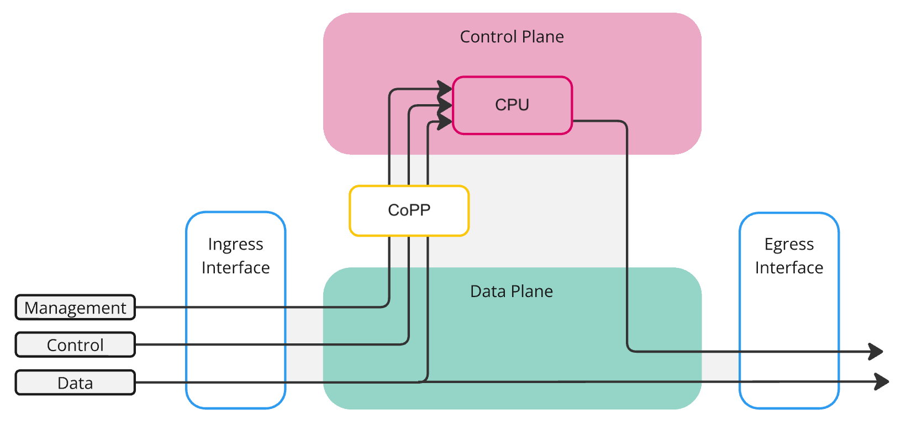

# Switch Architecture

This document provides a high-level overview of how network switches are designed internally: the separation between the control plane and the data plane, how packets traverse the switch, and why specialized forwarding hardware (NPUs) is used alongside — and sometimes instead of — general-purpose CPUs. These concepts apply to any modern data center switch, not just a specific vendor or model.

## Control Plane and Data Plane

Every network switch operates across two distinct processing domains:

- **Control plane** — The software-driven domain. A general-purpose CPU runs the network operating system, executes routing protocols (BGP, OSPF), negotiates protocol adjacencies, and computes forwarding decisions. It handles complex but infrequent tasks.

- **Data plane** — The hardware-driven domain. A purpose-built chip called a **network processing unit (NPU)** performs the actual forwarding of packets at wire speed. In the networking industry, NPUs are also referred to as switching ASICs, forwarding ASICs, or merchant silicon (when sold by a chip vendor to multiple switch manufacturers). The NPU does not compute routes or run software — it executes pre-programmed forwarding rules that the control plane installed.

This division is what allows a switch with a modest embedded processor to forward terabits per second of traffic: the CPU computes a routing decision once (e.g., BGP best path) and programs it into the NPU, which then handles all matching packets autonomously without further CPU involvement.

| Domain        | Component            | Role                                                   |
| ------------- | -------------------- | ------------------------------------------------------ |
| Data plane    | NPU (switching ASIC) | Forwards packets at wire speed across all ports        |
| Control plane | Management CPU       | Runs the NOS, routing protocols, and programs the NPU  |

## Why Specialized Hardware

A general-purpose CPU processes instructions sequentially and is optimized for flexibility: branch prediction, speculative execution, caches, and complex instruction sets. These features make CPUs ideal for control-plane tasks but unsuitable for data-plane forwarding at scale.

Consider the math for 100G Ethernet. At minimum-size packets (64 bytes), a single 100G port must process approximately **148.8 million packets per second**. A 32-port 100G switch must handle up to **4.76 billion packets per second** across all ports simultaneously. Each packet requires parsing headers, looking up forwarding tables, applying ACLs, updating counters, and queuing for output — all within a few hundred nanoseconds. No general-purpose CPU can sustain this rate.

NPUs solve this by implementing the forwarding logic directly in hardware:

- **Fixed-function pipelines** process packets in parallel across all ports simultaneously, rather than sequentially on a single instruction stream.
- **On-chip forwarding tables** (TCAM and hash-based) perform lookups in a single clock cycle, rather than traversing software data structures in memory.
- **Hardware schedulers and queuing engines** manage traffic shaping, priority, and congestion at wire speed without CPU intervention.
- **Integrated SerDes** convert between the chip's internal bus and the high-speed electrical signals on each port, eliminating the need for external PHY chips at these speeds.

The trade-off is flexibility: an NPU's forwarding behavior is defined by its pipeline design at fabrication time. It can only perform the operations its silicon was built to support. This is why different NPU families exist — Broadcom's Tomahawk optimizes for raw bandwidth, while Trident optimizes for feature depth and programmability (see the Broadcom Switching ASIC Generations section below).

## The Transit Path

A forwarded packet makes a three-part journey through the data plane:

- **Ingress** — The physical port where a packet enters the switch. The NPU's forwarding engine immediately parses the packet headers to determine the destination.

- **Switch fabric** — The high-speed internal crossbar that connects all ports. It transports the packet from the ingress port to the correct egress port. In single-chip designs (such as the Broadcom Tomahawk), the crossbar is integrated into the ASIC itself.

- **Egress** — The physical port where the packet leaves the switch toward its next hop.

A physical port operates as both ingress and egress simultaneously. In full-duplex mode, a 100G port can receive 100 Gbps and transmit 100 Gbps at the same time without interference. This is why switch throughput is sometimes quoted as double the port-speed sum (e.g., 6.4 Tbps full-duplex for a 3.2 Tbps switch).

## Traffic Types

Not all traffic follows the same path through the switch:

- **Data traffic** — Standard forwarded traffic (user applications, storage, compute). This is the vast majority of packets. Data traffic enters at ingress, crosses the switch fabric, and exits at egress without ever touching the CPU. This ASIC-only journey is called the **fast path**.

- **Control traffic** — Protocol traffic from other network devices (BGP updates, OSPF hellos, LLDP, ARP). These packets are intercepted by the NPU and diverted up to the control plane for software processing.

- **Management traffic** — Administrative sessions directed at the switch itself (SSH, SNMP, REST API). These also require CPU processing.

Control and management traffic follow the **slow path**: the NPU traps the packet and sends it to the CPU for software processing. The slow path is orders of magnitude slower than the fast path but handles only a tiny fraction of total traffic.

## Control Plane Policing (CoPP)

The CPU is a slow, shared resource receiving trapped packets from all ports. A flood of ARP requests or ICMP pings does not affect the NPU (it can trap millions per second), but every trapped packet lands on the CPU. Without rate-limiting, a burst of control traffic — malicious or accidental — can starve routing protocols of CPU cycles and destabilize the entire switch.

CoPP protects the CPU by rate-limiting the trap path. Trapped packets are classified into categories (BGP, ARP, ICMP, SSH, etc.), and each category is assigned its own rate limit. Packets within the allowed rate are delivered to the CPU; packets exceeding the rate are dropped before reaching it. CoPP sits at the boundary between the fast path and the slow path — the same position shown in the architecture diagram above.

## Major NPU Vendors

The NPU market is dominated by a small number of silicon vendors. Most data center switches sold today use merchant silicon from one of these companies, paired with an open or vendor-specific NOS.

| Vendor                     | Notable Product Lines             | Focus                                                                 |
| -------------------------- | --------------------------------- | --------------------------------------------------------------------- |
| **Broadcom**               | Tomahawk, Trident, Jericho        | Dominant market share in data center switching; bandwidth and feature breadth |
| **NVIDIA (Mellanox)**      | Spectrum, Spectrum-2/3/4          | Tightly integrated with NVIDIA ConnectX NICs; strong in AI/RDMA fabrics |
| **Intel (Barefoot)**       | Tofino, Tofino 2                  | Programmable (P4) pipeline; user-defined forwarding behavior at line rate |
| **Cisco (Silicon One)**    | Q100, Q200, G100                  | Unified architecture across routing and switching; used in Cisco's own platforms |
| **Marvell**                | Prestera, Teralynx, Aldrin        | Enterprise, carrier, and emerging data center switching                |
| **Innovium (now Marvell)** | TERALYNX                          | High-bandwidth data center switching; acquired by Marvell in 2021     |

All of these vendors provide [SAI (Switch Abstraction Interface)](https://github.com/opencomputeproject/SAI) implementations, which means SONiC can run on switches built with any of their ASICs. The SONiC source tree maintains a separate [platform directory](https://github.com/sonic-net/sonic-buildimage/tree/master/platform) for each vendor, reflecting this multi-vendor ecosystem.

The sections below focus on Broadcom in detail because it is the ASIC used in the DX010 and the most widely deployed merchant silicon in data center switches.

## Broadcom Switching ASIC Generations

Broadcom organizes its switching and routing ASICs under two platform brands:

- **StrataXGS** — The Ethernet switching platform, optimized for high port-density, low-latency, cut-through forwarding with shallow on-chip buffers (SRAM). This brand covers both the **Tomahawk** and **Trident** families used in data center and enterprise switches.

- **StrataDNX** — The carrier routing platform, optimized for deep packet buffering (external HBM), large routing tables (millions of FIB entries), MPLS/segment routing, and fabric-attach multi-chassis architectures. This brand covers the **Jericho** family used in service provider core routers and DCI platforms.

Both StrataXGS families roughly double in bandwidth every two years.

**Tomahawk (bandwidth-optimized)**

The **Tomahawk** family prioritizes raw switching bandwidth with a simpler fixed pipeline — it is used in spine switches and high-density leaf switches where throughput matters most.

| Generation | Chip     | Year | Throughput | SerDes         | Process |
| ---------- | -------- | ---- | ---------- | -------------- | ------- |
| Tomahawk   | BCM56960 | 2014 | 3.2 Tbps   | 128× 25G NRZ   | 28 nm   |
| Tomahawk 2 | BCM56970 | 2016 | 6.4 Tbps   | 256× 25G NRZ   | 16 nm   |
| Tomahawk 3 | BCM56980 | 2017 | 12.8 Tbps  | 256× 50G PAM4  | 7 nm    |
| Tomahawk 4 | BCM56990 | 2019 | 25.6 Tbps  | 512× 50G PAM4  | 7 nm    |
| Tomahawk 5 | BCM78900 | 2022 | 51.2 Tbps  | 512× 100G PAM4 | 5 nm    |

**Trident (feature-optimized)**

The **Trident** family prioritizes feature depth and programmability — it supports richer ACLs, deeper forwarding tables, and a compiler-programmable pipeline for enterprise and campus deployments. Trident ships in multiple SKUs per generation with varying lane counts, so throughput figures reflect the top-end variant.

| Generation  | Chip     | Year | Throughput      | SerDes    | Process |
| ----------- | -------- | ---- | --------------- | --------- | ------- |
| Trident     | BCM56840 | 2009 | 640 Gbps        | 10G NRZ   | —       |
| Trident 2   | BCM56850 | 2012 | 1.28 Tbps       | 10G NRZ   | 28 nm   |
| Trident 2+  | BCM56860 | 2014 | 1.28 Tbps       | 10G NRZ   | 28 nm   |
| Trident 3   | BCM56870 | 2017 | up to 3.2 Tbps  | 25G NRZ   | 16 nm   |
| Trident 4   | BCM56880 | 2019 | up to 12.8 Tbps | 50G PAM4  | 7 nm    |
| Trident 5   | BCM78800 | 2023 | 16 Tbps         | 100G PAM4 | 5 nm    |

**Jericho (carrier and DCI)**

The **Jericho** family targets carrier-grade routing and DCI (Data Center Interconnect). Jericho chips emphasize deep packet buffering (using HBM), large routing tables (millions of entries), and fabric-attach architectures for multi-chassis systems. They are used in core routers and spine-layer routers, not in ToR leaf switches.

| Generation  | Year | Throughput |
| ----------- | ---- | ---------- |
| Jericho     | 2013 | 1.2 Tbps   |
| Jericho+    | 2015 | 1.8 Tbps   |
| Jericho 2   | 2018 | 9.6 Tbps   |
| Jericho 2c+ | 2023 | 14.4 Tbps  |
| Jericho 3   | 2024 | —          |
| Jericho 4   | 2025 | 28.8 Tbps  |

## Software-Based Forwarding: VPP and DPDK

NPUs solve the performance problem by moving forwarding into fixed-function hardware. But there is an alternative philosophy: make *software* on commodity CPUs fast enough to forward packets at useful rates. This is the domain of **DPDK** and **VPP**.

### The Problem with the Kernel

The reason a general-purpose CPU is slow at forwarding is not just raw clock speed — it is the operating system's network stack. When a packet arrives at a standard Linux server, the kernel copies the packet between buffers, triggers interrupts, traverses multiple abstraction layers (socket API, netfilter, routing tables in software), and performs context switches. These overheads add microseconds per packet. At 10G line rate with small packets, the kernel cannot keep up.

### DPDK: Bypassing the Kernel

**DPDK (Data Plane Development Kit)**, originally developed by Intel, eliminates these overheads by bypassing the kernel entirely. A DPDK application runs in user space and takes direct control of the NIC hardware through poll-mode drivers. There are no interrupts, no kernel copies, and no context switches. The application polls the NIC continuously for new packets and processes them in a tight loop.

DPDK itself is a framework, not a forwarding application. It provides the fast I/O layer — reading packets from the NIC and writing them back — but the forwarding logic must be built on top.

### VPP: Vector Packet Processing

**VPP (Vector Packet Processing)**, originally developed by Cisco and now an open-source project under the Linux Foundation's [fd.io](https://fd.io) umbrella, is a full forwarding engine built on top of DPDK. Its key innovation is **vector processing**: instead of processing one packet at a time through the full forwarding pipeline, VPP collects a batch (vector) of packets and runs each pipeline stage across the entire batch before moving to the next stage.

This matters because of how modern CPUs work. When a CPU processes a single packet through multiple stages (parse → lookup → classify → queue), each stage accesses different code and data, constantly evicting and reloading CPU cache lines. By processing 256 packets through the same stage before moving on, VPP keeps the instructions and data for that stage hot in the L1/L2 cache, amortizing the cache-miss penalty across the entire batch.

VPP supports a full feature set: L2 bridging, L3 routing, NAT, ACLs, tunneling (VXLAN, GRE, IPsec), and can be extended with custom plugins. It can also act as a virtual switch (vSwitch) for VMs or containers.

### NPU vs Software Forwarding

The two approaches are complementary, not competing. They optimize for different points in the throughput-vs-flexibility trade-off:

| Dimension          | NPU (Hardware)                            | VPP/DPDK (Software)                          |
| ------------------ | ----------------------------------------- | --------------------------------------------- |
| Throughput         | Terabits per second (3.2–51.2 Tbps)       | Tens of gigabits per second (10–100 Gbps)     |
| Latency            | Sub-microsecond (~300–500 ns)             | Low microseconds (~5–50 µs)                   |
| Flexibility        | Fixed at fabrication; limited to what the silicon supports | Fully programmable; deploy new features with a software update |
| Cost model         | Dedicated switch hardware                 | Commodity x86 servers with standard NICs       |
| Power efficiency   | Optimized (purpose-built silicon)         | Higher power per bit (general-purpose CPU)     |
| Feature updates    | Requires new ASIC generation or NOS update within existing capabilities | Recompile and redeploy                        |
| Typical use cases  | ToR/spine switches, high-density data center fabrics | Virtual routers, NFV, edge/CPE appliances, service chaining, vSwitch |

**When to use NPU-based switches:** When throughput and port density are the primary requirements — data center fabrics, spine-leaf networks, and anywhere line-rate forwarding across many 100G+ ports is non-negotiable.

**When to use VPP/DPDK:** When flexibility and feature velocity matter more than raw throughput — virtual network functions (firewalls, load balancers, NAT gateways), custom protocol handling, or environments where forwarding logic changes frequently and waiting for a new ASIC generation is not acceptable.
