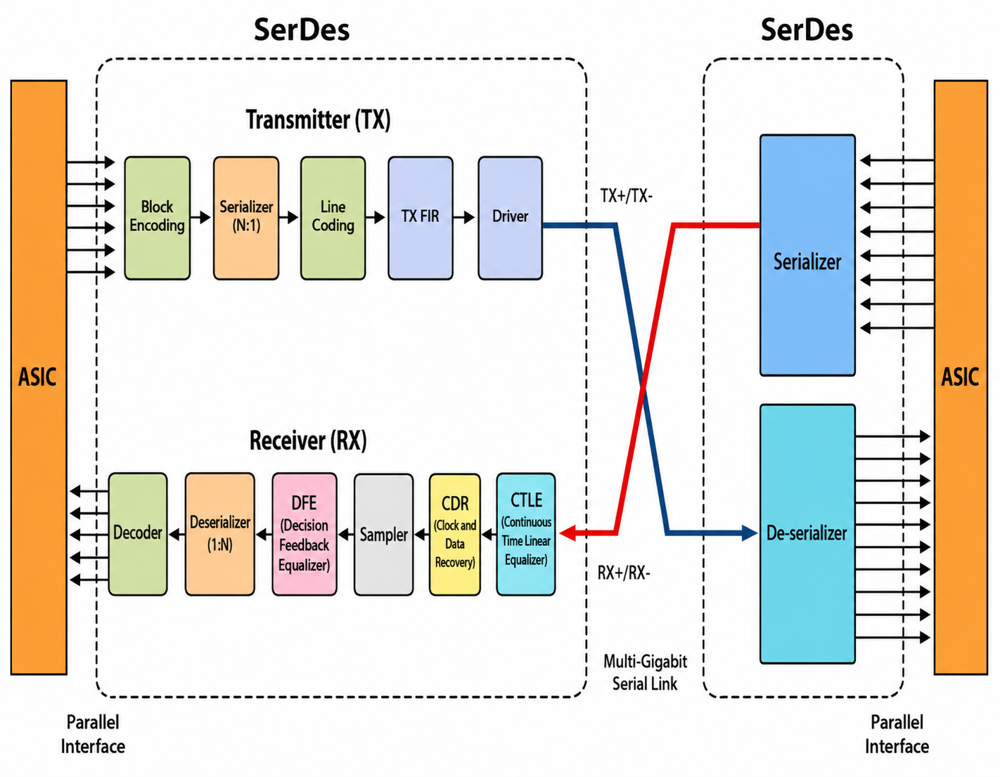
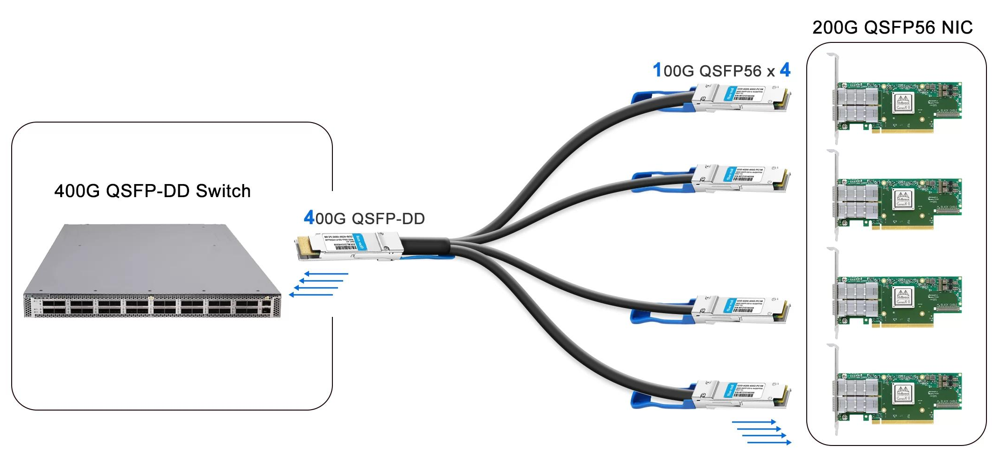

# SerDes and Lanes

This section explains how an NPU connects to the outside world at the physical level — the serialization of data for high-speed transmission, the lane and port architecture, and the signaling standards that define per-lane rates.

## Why Serial Links

Inside an NPU, data moves on wide parallel buses — hundreds of bits transferred simultaneously across short on-chip interconnects. This works within the chip because trace lengths are millimeters and skew is negligible. However, the moment data must leave the chip, parallel signaling breaks down. At multi-gigabit rates, ensuring that dozens of parallel wires arrive in precise time alignment over centimeters of board trace becomes impractical. Signal skew, crosstalk between adjacent traces, and connector pin count all become limiting factors.

The solution is **serialization**: converting the wide parallel bus into a small number of narrow, high-speed serial streams. A serial link drastically reduces pin count and routing complexity while enabling very high per-wire data rates.

## Differential Signaling

High-speed serial links use **differential pairs** to carry data. Instead of sending a voltage on a single wire measured against ground (single-ended signaling), a differential pair carries the signal as the voltage difference between two complementary conductors. The transmitter drives one conductor high while simultaneously driving the other low; the receiver measures only the difference between them. The two conductors are denoted TX+ / TX− for the transmit direction and RX+ / RX− for the receive direction.

This matters because at multi-gigabit rates, a ground reference becomes unreliable — power-supply fluctuations, return-path inductance, and nearby switching circuits all corrupt the baseline voltage. A differential pair sidesteps the problem entirely: both conductors travel together through the same PCB traces, connectors, and cables, so any external interference — electromagnetic coupling, power-rail bounce, thermal noise — affects both wires equally and cancels out when the receiver takes the difference.

The result is superior noise immunity (enabling reliable signaling at 25–100+ Gb/s), lower radiated emissions (the equal-and-opposite currents cancel each other's far-field radiation), and no dependence on a clean shared ground between transmitter and receiver.

## SerDes (Serializer / Deserializer)

A **SerDes** is the analog/mixed-signal circuit block on the NPU that performs this parallel-to-serial (and serial-to-parallel) conversion. Every high-speed port on a switch ASIC is driven by one or more SerDes circuits.

- **Transmit (Serializer):** Converts wide parallel data from the ASIC's internal fabric into a high-speed serial bitstream, encodes and shapes it, and drives it onto a differential pair (TX+ / TX−).

- **Receive (Deserializer):** Accepts the incoming serial bitstream from a differential pair (RX+ / RX−), recovers and decodes it, and reconstructs the original parallel data for the ASIC's internal logic.

The diagram below shows the internal stages of a SerDes:



On transmit:

    ASIC → Block Encoding → Serializer → Line Coding → TX FIR → Driver → TX+/TX−

On receive:

    RX+/RX− → CTLE → CDR → Sampler → DFE → Deserializer → Decoder → ASIC

On the transmit side, **block encoding** (e.g., 64b/66b with scrambling) adds framing, DC balance, and control characters to the parallel data. The **serializer** converts the wide parallel word into a single high-speed serial bitstream. **Line coding** maps serial bits to voltage levels — two levels for NRZ, four for PAM4. The **TX FIR** filter pre-shapes the waveform to compensate for predictable channel loss. The **driver** pushes the final signal onto the differential pair.

On the receive side, **CTLE** boosts high frequencies attenuated by the channel, partially restoring the signal so downstream stages can recover the data. **CDR** recovers the clock embedded in the data transitions. The **sampler** captures the signal at the optimal point using that clock. **DFE** cancels residual inter-symbol interference using previous decisions. The **deserializer** converts the recovered serial bitstream back into a wide parallel word. The **decoder** reverses block encoding — descrambling, removing sync headers, and extracting control characters — to recover the original data.

> The diagram omits FEC encoding, which sits between block encoding and the serializer on transmit, and between the deserializer and decoder on receive. For a detailed discussion of encoding stages and FEC, see [Digital Signal Fundamentals](03_signal_basics.md). For equalization and link training, see [Link Equalization](04_signal_training.md).

## SerDes Lanes

Each SerDes instance operates independently and constitutes one **lane** — four conductors in total: a TX differential pair (TX+/TX−) carrying data outbound and an RX differential pair (RX+/RX−) carrying data inbound, simultaneously. A 25G lane means 25 Gb/s in each direction; the per-lane rate always refers to one direction.

## SerDes Generations (OIF CEI)

The Optical Internetworking Forum (OIF) defines the Common Electrical Interface (CEI) specifications that standardize SerDes signaling rates across the industry. Each ASIC generation implements a specific CEI rate across all its SerDes instances:

| OIF Standard | Per-Lane Rate | Modulation | Example Form Factors                |
| ------------ | ------------- | ---------- | ----------------------------------- |
| CEI-10G      | 10 Gb/s       | NRZ        | SFP+, QSFP+                         |
| CEI-25G      | 25 Gb/s       | NRZ        | SFP28, QSFP28                       |
| CEI-56G      | 50 Gb/s       | PAM4       | SFP56, QSFP56, QSFP-DD (gen 1)      |
| CEI-112G     | 100 Gb/s      | PAM4       | SFP112, QSFP112, OSFP, QSFP-DD 800G |
| CEI-224G     | 200 Gb/s      | PAM4       | SFP224, QSFP224, OSFP-XD            |

## I/O Budget

The total number of lanes an ASIC contains, combined with its per-lane rate, defines the **I/O budget**: the hard upper limit on aggregate bandwidth the chip can deliver to the outside world.

    I/O budget = Total lanes × Per-lane rate

The table below shows how lane count and per-lane rate determine this budget across well-known switch ASICs:

| ASIC                           | Total Lanes | Per-Lane Rate | Modulation | I/O Budget  |
| ------------------------------ | ----------- | ------------- | ---------- | ----------- |
| Broadcom Tomahawk (BCM56960)   | 128         | 25 Gb/s       | NRZ        | 3.2 Tbps    |
| Intel Tofino 2                 | 256         | 50 Gb/s       | PAM4       | 12.8 Tbps   |
| Broadcom Tomahawk 4 (BCM56990) | 512         | 50 Gb/s       | PAM4       | 25.6 Tbps   |
| Broadcom Tomahawk 5            | 512         | 100 Gb/s      | PAM4       | 51.2 Tbps   |
| NVIDIA Spectrum-4              | 512         | 100 Gb/s      | PAM4       | 51.2 Tbps   |
| Broadcom Tomahawk 6 (BCM78910) | 512         | 200 Gb/s      | PAM4       | 102.4 Tbps  |

Note that ASICs targeting the same Ethernet bandwidth class (e.g., Tomahawk 5 and Spectrum-4) share the same SerDes rate and lane count, yet differ in forwarding features, buffer architecture, and programmability.

## Port Macros

A **port macro** (also called a port block or port group) is a fixed hardware block on the ASIC that owns a cluster of SerDes lanes — typically 4 or 8 — along with their shared MAC engine, PCS logic, and clocking circuitry. Each port macro maps to one physical front-panel cage.

For example, the Broadcom Tomahawk 1 divides its 128 lanes into 32 port macros of 4 lanes each. Those 32 macros correspond to 32 front-panel QSFP28 cages. The Tomahawk 5, with 512 lanes of 100G SerDes and 8-lane macros, has 64 port macros mapping to 64 OSFP cages.

## Ports and Breakout

A **port** is a logical interface formed by bonding one or more lanes within a port macro. The port's total speed is the sum of its lane speeds:

    Port speed = Per-lane rate × Number of lanes

By default, all lanes in a macro bond into a single port at the macro's full native speed (e.g., 4 × 25G = one 100G port on Tomahawk 1). This default configuration — one port per macro — is not the only option. Reconfiguring a macro to split its lanes into multiple independent ports is called **breakout** (also known as channel splitting or fan-out). Each resulting sub-port operates as a separate logical interface with its own MAC address, IP configuration, and forwarding behavior. The macro is the fixed silicon; the ports are flexible constructs within it.

The following example shows the same 4-lane port macro (25G NRZ SerDes) configured three different ways. The notation `MxS` describes the configuration: M logical ports each at speed S.

```
  Port Macro (4 × 25G SerDes lanes)
  ┌──────────────────────────────────────────────────────────┐
  │  Lane 0 (25G)  Lane 1 (25G)  Lane 2 (25G)  Lane 3 (25G)  │
  └──────────────────────────────────────────────────────────┘

  1×100G (default, all lanes bonded):
  ┌──────────────────────────────────────────────────┐
  │                  Port 0: 100G                    │
  │          Lane 0 + Lane 1 + Lane 2 + Lane 3       │
  └──────────────────────────────────────────────────┘

  2×50G (breakout, two lanes each):
  ┌────────────────────────┬─────────────────────────┐
  │     Port 0: 50G        │      Port 1: 50G        │
  │   Lane 0 + Lane 1      │    Lane 2 + Lane 3      │
  └────────────────────────┴─────────────────────────┘

  4×25G (breakout, one lane each):
  ┌───────────┬────────────┬────────────┬────────────┐
  │ Port 0:25G│ Port 1:25G │ Port 2:25G │ Port 3:25G │
  │  Lane 0   │  Lane 1    │  Lane 2    │  Lane 3    │
  └───────────┴────────────┴────────────┴────────────┘
```

**Why breakout exists:** Not every connected device operates at the full speed of the switch port. A switch with 400G physical ports may need to connect servers with 100G NICs. Without breakout, a high-speed port would be underutilized serving a single lower-speed device. With breakout, one physical cage can serve multiple endpoints, maximizing the switch's I/O budget utilization.



**Requirements and constraints:**

- The port macro hardware must support the requested lane grouping; not all ASICs support all possible subdivisions.

- Each port macro is independently configurable — one cage can run at full speed while an adjacent cage is broken out. A real switch typically uses a mix of configurations, not a uniform breakout across all macros.

- Within a single port macro, all lanes typically must operate at the same base signaling rate. Mixed-rate lanes within one cage are generally not supported.

- Breakout changes require the physical cabling to match. A breakout cable (fan-out cable) splits the high-density connector into multiple lower-density connectors — for example, one QSFP28 to four SFP28, or one OSFP to eight QSFP28.

- The total aggregate bandwidth of the switch does not change under breakout. Lanes are redistributed, not added.


## Front-Panel Port Layouts

While the ASIC defines the lane budget and breakout options, the switch vendor determines the physical port layout by selecting a cage type that targets a specific market. On the Tomahawk 1, the natural configuration — one QSFP28 cage per port macro — yields 32 front-panel ports at 100G each. Nearly every commercial switch built on this ASIC shipped with this identical layout:

| Switch           | Vendor         | Front-Panel Ports     |
| ---------------- | -------------- | --------------------- |
| Seastone DX010   | Celestica      | 32x QSFP28 (100G)     |
| AS7712-32X       | Edgecore       | 32x QSFP28 (100G)     |
| Wedge 100        | Facebook / OCP | 32x QSFP28 (100G)     |
| 7060CX-32S       | Arista         | 32x QSFP28 (100G)     |

No vendor productized a dedicated 64-port 50G or 128-port 25G Tomahawk 1 switch. The 100G market was the target, and lower speeds are reachable via per-port breakout on the same 32-cage platform. Dedicated 25G SFP28 switches (e.g., 48x25G + uplinks) were served by cheaper ASICs in Broadcom's Trident family, making a dedicated 128-port Tomahawk 1 design commercially unnecessary.

## SerDes IP Cores

Designing a SerDes is one of the hardest problems in semiconductor engineering. The circuit operates at the boundary between analog and digital — it must drive and recover signals at 100–200 Gb/s per lane through lossy channels, while meeting tight jitter, power, and area budgets. Building a competitive SerDes requires deep expertise in high-frequency analog design, process-node characterization, and years of silicon validation. This cost and complexity means that not every company designing an NPU also designs its own SerDes.

The semiconductor industry addresses this through **IP licensing**. Specialized companies develop SerDes circuits as reusable **IP cores** (also called IP blocks or hard macros) and license them to ASIC designers. The NPU vendor integrates the licensed SerDes IP into its chip layout alongside its own forwarding pipeline, memory subsystem, and other logic. The final chip is fabricated as a single die — the end user sees one ASIC, but internally it contains IP from multiple sources. This model is analogous to how many SoC designers license CPU cores from Arm rather than designing their own processor microarchitecture.

Some NPU vendors take the opposite approach and develop their SerDes entirely in-house, treating it as a competitive differentiator. Broadcom, for example, designs its own SerDes across all Tomahawk and Trident generations — its control over the full analog chain from SerDes through PHY to driver is a core part of its silicon advantage. NVIDIA (Mellanox) similarly develops proprietary SerDes for the Spectrum family. Other vendors — particularly smaller ASIC companies, FPGA makers, and startups — license from third parties to avoid the multi-year investment and instead focus engineering resources on their differentiated forwarding logic.

The table below lists the major SerDes IP providers in the industry:

| IP Vendor                 | Type | SerDes Portfolio | Max Lane Rate | Notes |
| ------------------------- | ----------------------- | --- | --- | --- |
| **Synopsys** (DesignWare) | Third-party licensor | 10G through 224G Ethernet PHY IP | 224 Gb/s | Largest semiconductor IP company; SerDes IP used across networking, AI accelerators, and HPC ASICs |
| **Cadence** (IP Group)    | Third-party licensor | 10G through 224G multi-protocol SerDes | 224 Gb/s | Major EDA vendor with broad analog/mixed-signal IP portfolio |
| **Alphawave Semi**        | Third-party licensor | 10G through 224G SerDes, DSP, and chiplet interconnect | 224 Gb/s | Pure-play connectivity IP company; supplies hyperscalers and custom ASIC designers |
| **Rambus**                | Third-party licensor | 56G through 224G SerDes PHY | 224 Gb/s | Known for memory interface IP; expanded into high-speed SerDes |
| **Credo Semiconductor**   | Third-party licensor + own products | 50G through 200G SerDes/DSP cores | 200 Gb/s | Also ships standalone retimer and active cable products using its own SerDes |
| **Broadcom**              | In-house (proprietary)     | All generations, 10G through 200G | 200 Gb/s | Designs SerDes for its own Tomahawk / Trident / Jericho ASICs; does not license to others |
| **NVIDIA (Mellanox)**     | In-house (proprietary)     | All generations for Spectrum and ConnectX | 100 Gb/s | Proprietary SerDes tightly co-designed with NIC and switch ASICs |
| **Marvell**               | In-house + acquired IP     | SerDes for Prestera, Teralynx, and custom platforms | 100 Gb/s | In-house capability bolstered by Inphi (optical DSP) and Innovium acquisitions |
| **Intel** (Altera)        | In-house (FPGA-integrated) | Transceiver hard macros in Stratix, Agilex FPGAs | 116 Gb/s | SerDes integrated into FPGA fabric; also used in Tofino switch ASICs |

A few patterns are worth noting. The third-party IP market is dominated by EDA giants (Synopsys, Cadence) and a handful of focused connectivity companies (Alphawave, Credo, Rambus). NPU vendors with the highest volumes (Broadcom, NVIDIA) tend to keep SerDes in-house because the engineering investment is amortized across millions of shipped ASICs and because co-optimizing SerDes with the forwarding pipeline yields performance and power advantages. Smaller or newer entrants license IP to reach market faster — the licensing fee is significant but far less than funding an analog design team for several years.

### Broadcom In-House SerDes Portfolio

Broadcom internally names each SerDes PHY generation using bird-themed code names. These names appear in the open-source OpenBCM SDK as `phymod` driver families (e.g., `tscf` = TSC Falcon, `tscbh` = TSC Blackhawk), where the **TSC** (Transport SerDes Core) prefix denotes the macro wrapper around the raw analog PHY.

Each new SerDes core first appears in the high-end Tomahawk line and is subsequently deployed in the cost-optimized Trident line:

| SerDes Core         | Per-Lane Rate | Modulation | OIF Standard | Switch ASIC Usage                                    |
| ------------------- | ------------- | ---------- | ------------ | ---------------------------------------------------- |
| Eagle (TSCE)        | 10 Gb/s       | NRZ        | CEI-10G      | Legacy StrataXGS (Trident 2 era and earlier)         |
| Merlin (TSC4-MC)    | 10 Gb/s       | NRZ        | CEI-10G      | Management ports on TH3/TH4; lower-tier front-panel  |
| Falcon (TSCF)       | 25 Gb/s       | NRZ        | CEI-25G      | TH1 (BCM56960), TH2 (BCM56970), Trident 3 (BCM56870) |
| Blackhawk (TSCBH)   | 50 Gb/s       | PAM4       | CEI-56G      | TH3 (BCM56980), TH4 / Trident 4 (Blackhawk7, 7nm)    |
| Peregrine           | 100 Gb/s      | PAM4       | CEI-112G     | TH5                                                  |
| Condor              | 200 Gb/s      | PAM4       | CEI-224G     | TH6 (BCM78910)                                       |

Key observations:

- **Falcon is shared across tiers.** Both Tomahawk 1/2 (data-center) and Trident 3 (enterprise) use the same Falcon SerDes core — the difference is lane count and forwarding features, not SerDes IP.

- **Blackhawk7 is a process shrink, not a new architecture.** TH4 and Trident 4 use "Blackhawk7" — the same Blackhawk analog design ported from 16nm (TH3) to 7nm. The SerDes is functionally equivalent; the shrink improves power and area.

- **Lane count scaling.** Tomahawk doubled its lane count from 128 (TH1) to 256 (TH2) within the Falcon generation. TH3 retained 256 lanes when it moved to Blackhawk (50G PAM4), then TH4 doubled again to 512 lanes. Since TH4, the lane count has held at 512 while per-lane rate doubles each generation — the I/O budget now scales purely through faster SerDes.

- **Jericho (not shown).** Broadcom's service-provider routing family (Jericho 2, Jericho 3) uses Blackhawk for 50G PAM4 fabric links alongside Falcon16 (a multi-lane variant) for 25G NRZ backward compatibility.
