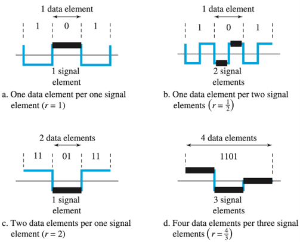
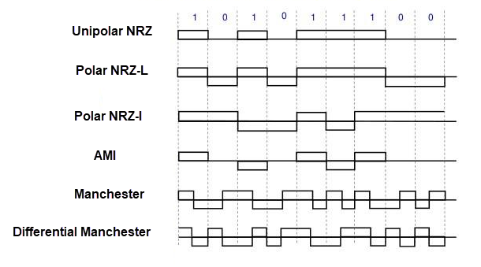
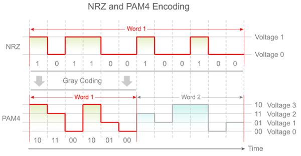
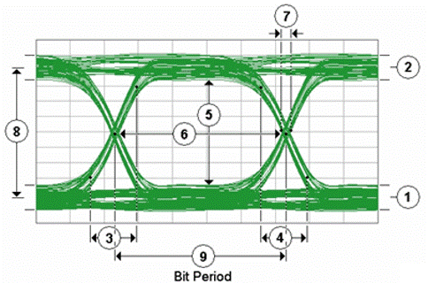
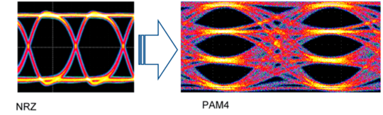

# Digital Signal Fundamentals

## Digital-to-Digital Conversion

Digital-to-digital conversion is the process of representing **digital data** (0s and 1s) as a **digital signal** (discrete voltage levels on a physical medium). In summary:

- **Data** — what we want to send (bits: 0 and 1)
- **Signal** — how we send it (voltage or current over time)

Even when the data is already digital, we need rules that describe how bits are mapped onto a signal waveform. That mapping is called **line coding**, and it directly affects bandwidth usage, clock recovery, noise immunity, and power efficiency.

## Data Element vs Signal Element

Understanding these two units is essential before discussing data rate, signal rate, or line coding.

A **data element** is the smallest unit of information — a single bit (0 or 1). Data elements describe *what* is being sent and exist at the logical level. A **signal element** is the smallest unit of the physical signal — a specific voltage level or transition that occupies a fixed time slot on the wire. Signal elements describe *how* data is carried across the medium.

The ratio between data elements and signal elements depends on the [line coding scheme](#line-coding-schemes). A single signal element may represent one data element, a fraction of one, or multiple data elements. For example, NRZ maps one signal element to one bit, PAM4 maps one signal element to two bits, and Manchester uses two signal elements per bit.

## Data Rate vs Signal Rate

**Data rate** (bit rate) is the number of data bits transmitted per second, measured in bps. When a link is described as "100 Gb/s," this refers to data rate. **Signal rate** (baud rate) is the number of signal elements transmitted per second, measured in baud. It reflects how fast the physical signal changes on the wire. The two are related by:

    signal rate = data rate ÷ (bits per signal element)

When each signal element carries one bit, the rates are equal. When each signal element carries more than one bit, the signal rate is lower than the data rate — and vice versa. The [line coding scheme](#line-coding-schemes) determines this ratio.

This distinction has direct physical consequences. A higher signal rate demands more bandwidth, tighter timing, and better signal integrity. Packing more bits into each signal element (as PAM4 does) reduces the signal rate but increases analog complexity and noise sensitivity. Modern high-speed systems carefully balance this trade-off to maximize data rate without exceeding the channel's physical limits.

## Line Coding Schemes

A line coding scheme defines the rules for mapping a stream of data bits into a signal waveform (specific voltage levels and transitions over time) so the receiver can reliably recover the data. Two properties of line coding schemes are important: DC component and clock recovery.

### DC Component

The DC component of a signal is its average voltage over time. In most high-speed serial links, the transmitter and receiver are **AC-coupled** — connected through capacitors that block any constant (DC) voltage offset. If a data pattern produces a sustained voltage imbalance (for example, a long run of 1s), the coupling capacitor charges and the receiver's baseline voltage drifts. This effect is called **baseline wander**, and it shifts the decision threshold used to distinguish 0s from 1s, increasing bit errors.

A scheme with "None" DC component guarantees zero average voltage over every code word, eliminating baseline wander entirely. Schemes with "High" or "Possible" DC component can produce sustained imbalance during long runs of identical bits.

### Clock Recovery

In most serial links, no separate clock signal is sent alongside the data. The receiver extracts timing from the data signal itself — a process called **clock recovery**. A CDR (Clock and Data Recovery) circuit monitors signal transitions and uses them to lock a local oscillator to the transmitter's symbol rate. Clock recovery quality depends on transition frequency. Schemes with guaranteed transitions every bit period (such as Manchester) provide excellent clock recovery.

### Comparison Table

| Category   | Scheme                  | Signal Levels | Bits per Signal Element | Clock Recovery    | DC Component | Notes                  |
| ---------- | ----------------------- | ------------- | ----------------------- | ----------------- | ------------ | ---------------------- |
| Unipolar   | Unipolar NRZ            | 2             | 1                       | Poor              | High         | Rarely used            |
| Polar      | Polar NRZ-L             | 2             | 1                       | Poor              | Possible     | Simple but sync issues |
| Polar      | Polar NRZ-I             | 2             | 1                       | Better than NRZ-L | Low          | Transition-based       |
| Polar      | RZ                      | 3             | 1                       | Good              | Low          | Uses more bandwidth    |
| Bipolar    | AMI                     | 3             | 1                       | Moderate          | None         | Used in telephony      |
| Bipolar    | Pseudoternary           | 3             | 1                       | Moderate          | None         | Variation of AMI       |
| Biphase    | Manchester              | 2             | 0.5                     | Excellent         | None         | Ethernet (10 Mbps)     |
| Biphase    | Differential Manchester | 2             | 0.5                     | Excellent         | None         | Immune to polarity     |
| Multilevel | 2B1Q                    | 4             | 2                       | Moderate          | Low          | ISDN                   |
| Multilevel | PAM4                    | 4             | 2                       | Poor alone        | Low          | Used in modern SerDes  |

### NRZ (Non-Return-to-Zero)

NRZ is a family of line coding schemes in which the signal stays at a constant level for the entire bit period — it does not return to a reference (zero) level between bits. Each symbol carries exactly one bit, so the data rate equals the baud rate. Three NRZ variants appear in the comparison table above.

**Unipolar NRZ** uses a single polarity: `+V` for 1 and `0 V` for 0. Because one of the two states is zero volts, any bit stream with more 1s than 0s (or vice versa) produces a sustained average voltage offset. This gives Unipolar NRZ a high DC component and makes it unsuitable for AC-coupled links. It is rarely used in practice.

**Polar NRZ-L** (Level) uses two opposite-polarity voltages: `+V` for 1 and `−V` for 0 (or vice versa). The bit value is encoded directly in the voltage *level*. Using both polarities reduces the DC component compared to unipolar signaling, but long runs of the same bit still produce a sustained voltage in one direction, so DC imbalance remains possible. Clock recovery is poor because identical consecutive bits produce no transitions for the CDR to track.

**Polar NRZ-I** (Invert) encodes data in *transitions* rather than levels: a 1 causes a polarity inversion at the start of the bit period, while a 0 keeps the signal unchanged. This means a run of 1s produces a transition every bit period, giving NRZ-I better clock recovery than NRZ-L for 1-heavy data. However, a run of 0s still produces no transitions, so clock recovery can degrade on 0-heavy patterns.

In modern high-speed serial links, "NRZ" almost universally refers to Polar NRZ-L. Its simplicity makes it power-efficient, and with only two levels the full voltage swing separates 0 from 1, maximizing noise margin. Its weaknesses — poor clock recovery during long identical-bit runs and possible DC imbalance — are mitigated by [block encoding](#block-encoding-pcs-encoding) and scrambling rather than by changing the line code itself.

### PAM4 (Pulse Amplitude Modulation, 4-Level)

With NRZ, the only way to increase data rate is to increase the symbol rate — transmit more symbols per second. But the physical channel pushes back: higher symbol rates mean higher-frequency signal components, and copper traces and connectors attenuate high frequencies far more than low frequencies. At some point, the channel loss becomes so severe that the signal arriving at the receiver is too degraded to sample reliably, no matter how good the equalization is. For NRZ over typical Ethernet channel lengths, this practical ceiling is around 25–28 GBd per lane.

PAM4 sidesteps this limit by encoding more data into each symbol rather than transmitting symbols faster. Instead of two voltage levels (1 bit per symbol), PAM4 uses four voltage levels (2 bits per symbol), doubling the data rate at the same baud rate:

| Voltage Level | Binary (no Gray)  | Gray Encoded |
| ------------- | ----------------- | ------------ |
| Lowest        | 00                | 00           |
| Low-mid       | 01                | 01           |
| High-mid      | 10                | 11           |
| Highest       | 11                | 10           |

For example, a 112-Gbaud PAM4 signal delivers 224 Gb/s of raw data — twice what NRZ achieves at the same baud rate.

The trade-off is noise margin: packing four levels into the same voltage swing means each level is separated by only one-third the distance of NRZ's two levels, making PAM4 significantly more susceptible to noise and requiring stronger error correction (see [FEC](#forward-error-correction-fec)).

### Gray Code in PAM4

Gray code assigns bit patterns to adjacent signal levels such that neighboring levels differ by only one bit. In PAM4, without Gray coding, the four levels would be labeled 00, 01, 10, 11 — and a transition between 01 and 10 (the middle pair) would flip both bits. With Gray coding (00, 01, 11, 10), every adjacent-level error changes only one bit.

This matters because PAM4's tight level spacing makes level-to-level confusion the most common error. Gray coding ensures the most likely error (confusing adjacent levels) produces a single-bit error instead of a two-bit error, cutting the effective bit error impact in half and improving observed BER without any analog hardware changes.

## Block Encoding

Line coding defines how bits map to voltage levels on the wire. But before line coding is applied, the raw data stream must be prepared for reliable transmission. This preparation — called **block encoding** — is a fixed-ratio transformation applied at the Physical Coding Sublayer (PCS) that converts blocks of data bits into slightly larger coded blocks.

Block encoding solves problems that line coding alone cannot:

- **Framing and synchronization:** The receiver must find where one block ends and the next begins. Block encoding inserts recognizable patterns (sync headers or special code groups) that allow the receiver to align to block boundaries.

- **DC balance and run-length limiting:** Long runs of identical bits cause baseline wander in AC-coupled links, and the CDR loses transitions to lock onto. Block encoding guarantees sufficient transitions and limits maximum run length.

- **Control characters:** The link needs to carry non-data signals — idle patterns, start-of-frame delimiters, error indications, and ordered sets. Block encoding provides a distinct control code space so the receiver can distinguish data from protocol signaling without ambiguity.

- **Error detection:** Some block codes can detect certain transmission errors at the physical layer, such as invalid code groups that cannot occur in normal operation.

The cost is overhead: encoding N data bits into M coded bits means (M−N)/M of the raw channel bandwidth carries non-data bits. The evolution of block codes has steadily reduced this overhead:

| Encoding  | Data Bits | Coded Bits | Overhead | Used In                                      |
| --------- | --------- | ---------- | -------- | -------------------------------------------- |
| 4b/5b     | 4         | 5          | 20%      | Fast Ethernet (100BASE-TX)                   |
| 8b/10b    | 8         | 10         | 20%      | 1GbE, Fibre Channel, PCIe Gen1–2, SATA       |
| 64b/66b   | 64        | 66         | 3.125%   | 10GbE, 25GbE, 40GbE, 100GbE                  |
| 128b/130b | 128       | 130        | 1.56%    | PCIe Gen3                                     |
| 128b/132b | 128       | 132        | 3.125%   | USB 3.0 / 3.1                                 |
| 256b/257b | 256       | 257        | 0.39%    | PCIe Gen4–5                                   |

### 8b/10b

8b/10b replaces every 8-bit byte with a 10-bit code word chosen from a lookup table. The table is designed so that every valid code word has near-equal numbers of 0s and 1s (DC balance), and no valid code word produces more than five consecutive identical bits (run-length limiting). A running disparity counter tracks cumulative DC imbalance and selects between two encodings of each byte to keep the link balanced over time.

The 20% overhead is substantial: a link running at 1.25 Gbaud delivers only 1 Gbps of user data. At higher speeds this waste becomes prohibitive, which is why 8b/10b was replaced.

### 64b/66b

64b/66b takes a fundamentally different approach. Instead of encoding each byte through a lookup table, it processes 64-bit blocks and prepends a 2-bit **sync header**: `01` for data blocks, `10` for control blocks. The 64-bit payload is then **scrambled** (XOR'd with a known polynomial sequence) rather than table-encoded.

Scrambling achieves DC balance and transition density statistically rather than deterministically — it does not guarantee the absence of long runs in any single block, but over time the scrambled stream is effectively random and well-balanced. This reduces overhead from 20% to 3.125%.

The 2-bit sync header also provides framing: the receiver searches for the alternating `01`/`10` pattern to find block boundaries, a process called **block lock**. Once locked, the receiver can distinguish data from control blocks and decode the scrambled payload.

### Block Encoding vs Line Coding

Block encoding and line coding operate at different layers and solve different problems:

| Aspect       | Block Encoding                               | Line Coding                              |
| ------------ | -------------------------------------------- | ---------------------------------------- |
| Layer        | PCS (digital, above the wire)                | PHY (analog, on the wire)                |
| Input/Output | Data bits → coded bits                       | Coded bits → voltage levels              |
| Purpose      | Framing, DC balance, control characters      | Bit-to-signal mapping, modulation        |
| Examples     | 8b/10b, 64b/66b                              | NRZ, PAM4, Manchester                    |

Both layers are necessary: block encoding prepares the bitstream for reliable transport, and line coding converts the prepared bits into physical signals.

## Signal Distortion

Signal distortion occurs when the waveform that arrives at the receiver differs in shape from the waveform that was transmitted. The signal is not lost — it is altered enough that the receiver can no longer reliably determine the intended values.

The transmission channel (wire, trace, cable) behaves as an analog system that can attenuate, delay, reshape, and reflect parts of the signal. Sharp transitions become rounded, voltage levels shift, and energy from one symbol may overlap with the next.

Common causes:

- **Channel loss (attenuation):** The signal loses strength as it propagates. Different frequency components are attenuated by different amounts, leading to slower edges and waveform reshaping.

- **Inter-symbol interference (ISI):** Energy from one symbol spreads into adjacent symbols because the signal does not fully settle before the next symbol arrives.

- **Reflections:** Impedance mismatches in cables, traces, connectors, or interfaces cause parts of the signal to reflect and interfere with the original waveform.

- **Noise:** Thermal noise, crosstalk, power supply noise, and external interference add random variations to the signal.

- **Timing jitter:** Variations in signal timing cause uncertainty in when the receiver samples, increasing the chance of incorrect decisions.

- **Nonlinear effects:** Active or passive components operating outside their ideal range may distort signal amplitude or shape.

## Eye Diagram

An eye diagram is created by overlaying many bit periods of a signal on top of each other, revealing how much voltage and timing margin the receiver has when deciding whether each symbol is a 0 or a 1. The more open the "eye," the more reliably the receiver can sample the signal.

The following shows the eye diagram for an NRZ (two-level) signal:

<table><tr>
<td></td>
<td valign="top">

1. Zero level
2. One level
3. Rise time
4. Fall time
5. Eye height
6. Eye width
7. Deterministic jitter
8. Eye amplitude
9. Bit period

</td>
</tr></table>

**Eye height** (vertical opening) represents the voltage margin at the sampling point. A taller eye means the signal levels are well-separated, so noise is less likely to cause misdetection.

**Eye width** (horizontal opening) represents the timing margin. A wider eye means the receiver can tolerate more clock jitter and still sample correctly.

Together, eye height and eye width define the **eye opening** — the clear region in the center of the diagram where the receiver can sample safely. When the eye opening is large, communication is stable. When the eye closes — due to any of the distortion mechanisms above — voltage and timing margins shrink, the receiver starts misdetecting symbols, bit errors increase, and at higher layers this manifests as link flapping, retries, or instability.

The impact of modulation on eye quality is visible when comparing NRZ and PAM4. NRZ produces a single wide eye opening between its two voltage levels. PAM4 splits the same voltage swing across four levels, creating three stacked eyes each approximately one-third the height — significantly reducing voltage margin per symbol:

## BER (Bit Error Rate)

A bit error occurs when the receiver misinterprets a transmitted bit — a 1 is decoded as 0, or vice versa. This is the direct consequence of the signal distortion described above.

**BER** (Bit Error Rate) is the ratio of incorrectly received bits to total bits transmitted. A BER of 1e-12 means one bit error per trillion bits sent. In data-center environments, BER at this level or better is typically required for a link to be considered reliable.

The eye diagram and BER are complementary: the eye diagram *predicts* how likely errors are (by showing voltage and timing margin), while BER *measures* how many errors are actually occurring.

## Forward Error Correction (FEC)

### Why FEC Is Needed

A SerDes lane transmits billions of symbols per second over copper or fiber. At these frequencies, insertion loss, crosstalk, impedance discontinuities, and thermal noise degrade the received signal, causing a fraction of bits to be decoded incorrectly.

For a link to be usable by Ethernet, the delivered BER must be below 10⁻¹² (fewer than one error per trillion bits). Without assistance, high-speed links routinely operate at raw BERs of 10⁻⁶ to 10⁻⁴ — orders of magnitude worse than the target.

### What FEC Is

Forward Error Correction is a coding scheme applied by the transmitter that adds structured redundancy to the data stream. The receiver uses this redundancy to detect and correct bit errors without retransmission, delivering a corrected output with a BER far below the raw channel BER.

The trade-off is latency: the receiver must buffer an entire FEC codeword before it can decode and correct errors. Stronger FEC codes correct more errors but add more latency.

### FEC Requirements by Signaling

Whether FEC is optional or mandatory depends on the signaling scheme and its noise margin:

- **NRZ at 10G–25G:** The wide voltage margin between two levels keeps raw BER relatively low (10⁻⁸ to 10⁻⁵ depending on cable type and length). Short, high-quality links may achieve 10⁻¹² without FEC. Longer or lossier links need FEC to close the gap.

- **PAM4 at 50G+ per lane:** As described in the [PAM4](#pam4-pulse-amplitude-modulation-4-level) section, four levels within the same voltage swing reduce inter-level spacing by ~3x, cutting noise margin by approximately 9.5 dB. Raw BER is inherently in the 10⁻⁴ to 10⁻³ range — completely unusable without FEC. There is no "FEC off" mode that produces a working link.

| Signaling | Lane Rate | Noise Margin | FEC Requirement                             |
| --------- | --------- | ------------ | ------------------------------------------- |
| NRZ       | 10G       | High         | Optional (most links work without it)       |
| NRZ       | 25G       | Moderate     | Recommended; required on longer/lossy links |
| PAM4      | 50G+      | Low          | Mandatory (link cannot function without it) |

### FEC Types

Ethernet standards define two FEC schemes. They differ in correction strength, overhead, and latency.

**FC-FEC (Firecode FEC)**, defined in IEEE 802.3 Clause 74, is based on a simple Hamming-like code. It adds low overhead (~3%) and very low latency, but can only correct isolated single-bit errors. It cannot handle the multi-bit burst errors that are common on lossy channels. FC-FEC was designed for 10GbE and 25GbE NRZ links where raw BER is already relatively low and only occasional single-bit corrections are needed.

**RS-FEC (Reed-Solomon FEC)**, defined in IEEE 802.3 Clause 91 (for 25G/100G) and Clause 108 (for 50G/200G/400G), is a block-based code that operates on multi-bit symbols rather than individual bits. RS-FEC can correct burst errors — multiple consecutive corrupted bits within a codeword — making it far more powerful than FC-FEC. The trade-off is higher latency, since the receiver must buffer a full RS codeword before decoding. RS-FEC adds roughly 3% overhead (similar to FC-FEC), but its correction capability is orders of magnitude stronger.

| FEC Type | IEEE Clause | Correction Capability    | Overhead | Latency | Typical Use                   |
| -------- | ----------- | ------------------------ | -------- | ------- | ----------------------------- |
| FC-FEC   | Clause 74   | Single-bit errors only   | ~3%      | Low     | 10GbE, 25GbE (NRZ)            |
| RS-FEC   | Clause 91   | Burst errors (multi-bit) | ~3%      | Higher  | 25GbE, 100GbE (NRZ)           |
| RS-FEC   | Clause 108  | Burst errors (multi-bit) | ~3%      | Higher  | 50GbE, 200GbE, 400GbE+ (PAM4) |

For NRZ links, the choice between FC-FEC, RS-FEC, or no FEC depends on channel quality. For PAM4 links, RS-FEC is the only viable option — the burst-error patterns inherent to PAM4's narrow eye openings exceed what FC-FEC can correct.

### Both Ends Must Match

FEC negotiation does not exist on most Ethernet links. Both ends must be statically configured to the same FEC mode. If one end expects RS-FEC and the other expects no-FEC (or FC-FEC), the link stays down — the receiver cannot frame-lock on the incoming data. There is no graceful fallback and typically no useful error message; the port simply shows `Oper: down`.

## Encoding in SerDes

With line coding, block encoding, and FEC covered, we can now describe how modern SerDes links combine them. In a SerDes transmit path, the data passes through these stages before reaching the wire:

    Data → Block encoding (64b/66b + scrambling) → FEC encoding → Serializer → Line coding (NRZ or PAM4) → TX FIR → Driver → Wire

Block encoding, FEC encoding, and the serializer operate in the digital domain. The serializer converts the wide parallel word into a single high-speed serial bitstream. From that point the analog stages take over: line coding maps bits to voltage levels, the TX FIR pre-compensates for channel loss, and the driver pushes the signal onto the differential pair.

On receive, the reverse occurs:

    Wire → CTLE → CDR → Sampler → DFE → Deserializer → FEC decoding → Block decoding → Data

### Encoding Combinations by Ethernet Generation

Each Ethernet speed standard specifies a particular block encoding, line coding, and lane count. The table below shows these combinations and the resulting per-lane symbol rate (baud rate) that the SerDes must sustain on the wire.

| Ethernet Speed | Block Encoding | Line Coding | Lanes       | Per-Lane Baud Rate |
| -------------- | -------------- | ----------- | ----------- | ------------------ |
| 1GbE           | 8b/10b         | NRZ         | 1           | 1.25 GBd           |
| 10GbE          | 64b/66b        | NRZ         | 1           | 10.3125 GBd        |
| 25GbE          | 64b/66b        | NRZ         | 1           | 25.78125 GBd       |
| 40GbE          | 64b/66b        | NRZ         | 4 × 10G     | 10.3125 GBd        |
| 100GbE         | 64b/66b        | NRZ         | 4 × 25G     | 25.78125 GBd       |
| 50GbE          | 64b/66b        | PAM4        | 1 × 50G     | ~26.6 GBd          |
| 200GbE         | 64b/66b        | PAM4        | 4 × 50G     | ~26.6 GBd          |
| 400GbE         | 64b/66b        | PAM4        | 8 × 50G     | ~26.6 GBd          |
| 400GbE         | 64b/66b        | PAM4        | 4 × 100G    | ~53.1 GBd          |
| 800GbE         | 64b/66b        | PAM4        | 8 × 100G    | ~53.1 GBd          |

Two patterns are visible in this table:

**8b/10b was replaced by 64b/66b at 10G.** At 1GbE, the 20% overhead of 8b/10b is tolerable (1.25 GBd on the wire for 1 Gbps of data). At 10 Gbps and above, wasting 20% of the channel bandwidth is not acceptable. 64b/66b reduces encoding overhead to 3.125% and has been used for every Ethernet generation since.

**NRZ was replaced by PAM4 at 50G per lane.** As described in the [NRZ](#nrz-non-return-to-zero) and [PAM4](#pam4-pulse-amplitude-modulation-4-level) sections, NRZ hits a practical channel-loss ceiling around 25–28 GBd. PAM4 doubles the data rate per lane without increasing the baud rate — a 50G PAM4 lane runs at roughly the same baud rate as a 25G NRZ lane. The trade-off is reduced noise margin, which makes [FEC](#forward-error-correction-fec) mandatory for all PAM4 links.

### Line Rate Calculation

The per-lane baud rate in the table above is derived from the data rate, block encoding overhead, [FEC](#forward-error-correction-fec) overhead, and bits per symbol:

    baud rate = data rate × (coded bits / data bits) × FEC overhead factor ÷ bits per symbol

For example, a 25GbE NRZ lane (no FEC):

    25 Gbps × (66 / 64) × 1 ÷ 1 = 25.78125 GBd

A 50GbE PAM4 lane (with RS-FEC adding ~3% overhead):

    50 Gbps × (66 / 64) × ~1.03 ÷ 2 ≈ 26.6 GBd
