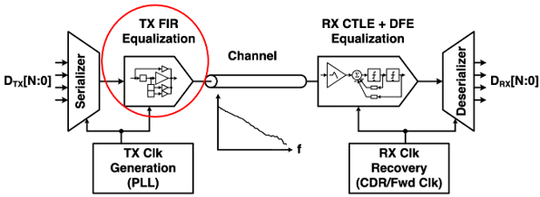
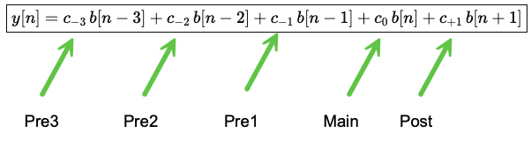
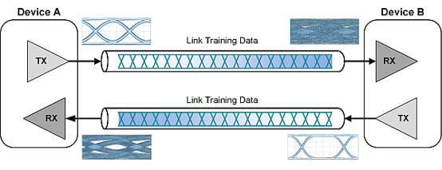

# Link Equalization and Training

## Link Equalization

Equalization is the intentional shaping of a signal to compensate for distortion introduced by the physical channel, enabling the receiver to reliably recover the data. It is applied on both the transmit and receive sides:

| Side | Purpose                   | Techniques         |
| ---- | ------------------------  | ------------------ |
| TX   | Prevent distortion        | FIR / pre-emphasis |
| RX   | Undo remaining distortion | CTLE + DFE         |

They solve the same problem from opposite ends. Together, TX and RX equalization form a coordinated system that allows SerDes links to operate at very high data rates over imperfect physical channels while maintaining an open eye, low bit-error rate, and reasonable power consumption. The diagram below focuses on the equalization stages within the SerDes signal path:



> Encoding, FEC, and the full stage pipeline are covered in [Digital Signal Fundamentals](03_signal_basics.md#encoding-in-serdes).

After encoding and serialization, the serial bitstream passes through **TX equalization**, typically implemented as a TX FIR (feed-forward) filter. TX equalization intentionally reshapes the transmitted waveform to pre-compensate for predictable channel losses — especially high-frequency attenuation — so that the signal arrives at the receiver with better edge sharpness and timing margin.

The signal then traverses the physical channel (PCB traces, connectors, cables). As described in [Signal Distortion](03_signal_basics.md#signal-distortion), the channel attenuates different frequencies by different amounts and causes inter-symbol interference. Because this distortion depends on the specific physical link, it cannot be fully eliminated at the transmitter alone.

The receiver applies its own **RX equalization**, typically a combination of CTLE (Continuous-Time Linear Equalizer) and DFE (Decision Feedback Equalizer). CTLE boosts high-frequency components in the analog signal to counteract channel loss. DFE digitally subtracts residual interference from previously detected symbols, reducing ISI without amplifying noise.

After equalization and sampling, the deserialized data passes through FEC decoding and block decoding to reconstruct the original parallel word.

### FIR (Finite Impulse Response) Filter

A FIR filter is a signal-processing block that generates each output sample as a weighted sum of a finite number of input samples taken at different time offsets. In a SerDes transmitter, the FIR filter operates at the symbol rate and is used to deliberately shape the transmitted waveform. An FIR filter is defined by its taps and weights.

- A **tap** represents a delayed version of the data stream, typically aligned to integer symbol intervals (for example, one bit earlier, two bits earlier, or one bit later).
- A **weight** is a numeric coefficient applied to that delayed data.

In a SerDes transmitter, the TX FIR filter is implemented as a multi-tap feed-forward equalizer, where each tap corresponds to a symbol-spaced delayed version of the transmit data stream.

The taps are organized relative to the current bit being transmitted, called the **main cursor**:

- **Main cursor** — Controls the amplitude of the current bit. Often tuned through a parameter called Atten, it dominates eye height and noise margin.

- **Pre-cursor taps** (Pre1, Pre2, …) — Act on upcoming bits that have not yet been transmitted. Because the transmitter knows the entire data sequence, it can look ahead and pre-distort the current output to cancel **pre-cursor ISI**: the tendency for a future bit's energy to arrive slightly early at the receiver due to the channel's impulse response.

- **Post-cursor taps** (Post1, Post2, …) — Act on bits that have already been transmitted. They pre-distort the current output to cancel **post-cursor ISI**: the residual energy of past bits that lingers into the current symbol period at the receiver (the tail of the channel's impulse response).

The number of taps and their placement depend on the SerDes architecture, supported data rates, modulation scheme (NRZ vs PAM4), and channel characteristics. As a result, an implementation may include only a single pre-cursor and post-cursor tap, or it may support multiple pre-cursor taps (e.g., Pre1, Pre2, Pre3) and multiple post-cursor taps. Supporting additional taps allows the transmitter to compensate for longer channel impulse responses and more severe inter-symbol interference.



Positive weights add energy, negative weights subtract energy, and zero disables a tap entirely. By carefully choosing these values, the transmitter boosts transitions, reduces long flat regions, and restores high-frequency content lost in the channel.

## Link Training

At high speeds, the electrical channel (PCB traces, connectors, cables) distorts signals in ways that depend on the specific physical link. The equalization described above is split between TX and RX. As an analogy:

- TX FIR is like speaking louder or sharper before sound travels through a noisy hallway.
- RX EQ is like noise-cancelling headphones that adapt to what they hear.

If all links were identical, we could hardcode EQ settings. But in reality:

- Cable lengths differ
- PCB routing differs
- Temperature changes
- Voltage drifts
- Aging affects analog behavior

So the best EQ settings are not static. These weights are not fixed and can change depending on environment, channel, and policy. That is exactly why link training exists.

Link training is the automatic startup calibration process that runs when a link comes up. Its job is simple but critical: Find a combination of TX and RX settings that produces a stable, low-BER link as quickly as possible. Link training typically takes 1 to 3 seconds and runs:

- When a port comes up
- When a cable is plugged or changed
- When link speed changes (e.g., 100G → 400G)
- After reset or power cycle



During link training, the system automatically:

- Brings the PHY/SerDes online
- Tests signal quality using training patterns or PRBS
- Tries combinations of parameters:
  - TX FIR weights (pre / cursor / post)
  - RX CTLE / DFE settings
  - PLL / CDR parameters
- Measures quality:
  - Eye margin
  - Error counters / BER proxies
- Selects a working configuration
- Locks it in and declares link "up"

### Link Training Data Access

Access to link-training and SerDes diagnostic data is one of the most powerful but often least documented debugging tools on high-speed networking devices.

During normal operation, vendors typically do not expose this information through standard customer-facing CLIs or APIs because it is low-level, hardware-specific, and easy to misinterpret. However, internally vendors provide hidden or debug commands that dump the exact state of the SerDes at the end of link training or during runtime.

Such debug commands read directly from SerDes control and status registers (CSR) inside the ASIC. During link training, the PHY firmware and hardware control loops program dozens of internal parameters. When the debug command is executed, the driver or firmware walks these registers and prints their decoded values in a human-readable form.

```
Transmitter (TX) Configuration
  SerDes Address: :1
  Lane: 1
  Data Width: 80
  Modulation: PAM4
  Gray Encoding: ON
  Polarity Inversion: OFF
  Rate / Divider: 1.0 / 170
  Output Path: CORE

TX FIR / Pre-emphasis Weights
  Pre3: 1
  Pre2: 0
  Pre1: -2
  Main Cursor Attenuation: 2
  Post-cursor: 0

Receiver (RX) Configuration
  SerDes Address: :1
  Lane: 1
  Data Width: 80
  Modulation: PAM4
  Gray Encoding: ON
  Rate / Divider: 1.0 / 170
  Data Path: OFF
  Comparison Mode: XOR
  Quality Mode: even, lsb

Link Status
  Link OK: 1
  Link Locked: 1
  Loopback: 0
  Core Output: 0x0030
  Termination: FLOAT
  Phase: 0
  Errors: -
  BER: -

PLL Configuration
  TX PLL
    Baseband Gain (bbGAIN): 25
    Integrator Gain (intGAIN): 7
  RX PLL
    Baseband Gain (bbGAIN): 2
    Integrator Gain (intGAIN): 7

RX Eye Indicator
  EI Threshold: 0

Receiver Equalization
  CTLE (Continuous-Time Linear Equalizer)
    DC: 00
    LF Gain: 03
    HF Gain: 03
    Bandwidth: 03
    Gain1: 01
    Gain2: 02
    SC: 00
  RX Feed-Forward Equalizer (FFE)
    Tap 1–7: 1, 3, 0, 1, 8, 0, 0

Voltage Offset Settings (VOS)
  DATA path: -4e, -53, 3, -2, 53, 4e
  TEST path: -33, 75

Clock/Data Recovery (CDR)
  CDR State: 0
  CDR Mode: 0

Vernier / Phase Controls
  Phase Offsets: -1, 0, -1, 0, -1, 0, 0, -1, 0, 0, 0

Decision Feedback Equalizer (DFE)
  Tap values (1–D): ff, ff, 1, 4, 2, 2, 1, 1, 0, 1, 0, 0

Eye Metrics
  Eye Height Samples: 36, 36, 34, 36, 38, 34
  Measurement Dwell Time: 1e-05

Status Code
  Status: 08 e2
```

### Link Training Goals

Link training is conservative by design. Its priorities are **stability** (the link must not flap or accumulate errors), **fast link-up** (higher layers can start operating without delay), and **safe signal margins** (the chosen equalization and clocking parameters leave comfortable voltage and timing headroom). These conservative choices reduce the risk of intermittent failures that are extremely difficult to debug once the system is in service.

For this reason, link training explicitly does not prioritize:

- Power optimization
- Long-term efficiency
- Thermal optimization

Aggressively lowering voltages, shrinking margins, or experimenting with just barely good enough settings during link bring-up would increase the chance of instability, prolonged training time, or outright link failure.

In networking systems, a slightly higher power draw is almost always preferable to an unreliable link: a flapping or error-prone link can disrupt traffic, trigger retries or reconvergence, and destabilize the entire system.

Link training also does not modify SerDes supply voltages or voltage ranges. Adjusting rail voltages during link bring-up would introduce settling time, risk analog instability, and complicate the process. Instead, link training operates within fixed, pre-established voltage rails and focuses exclusively on tuning equalization, clocking, and sampling parameters.

Once link training has completed and the port is up, the system has achieved its primary goal: a stable, error-free link with safe signal margins. At that point, link training is finished and is not repeatedly rerun under normal operation.
