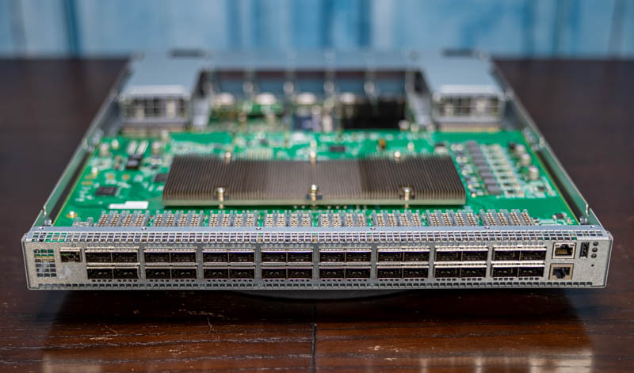
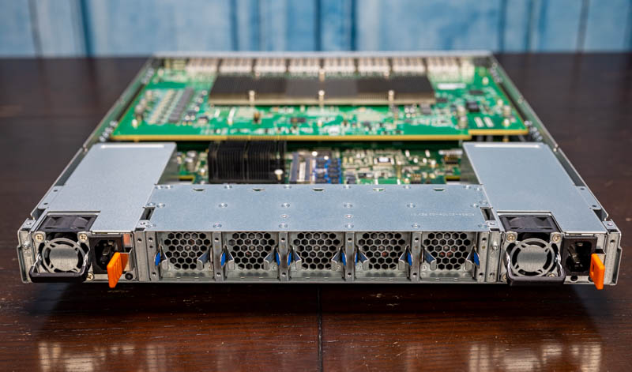
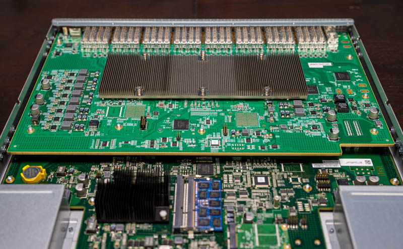
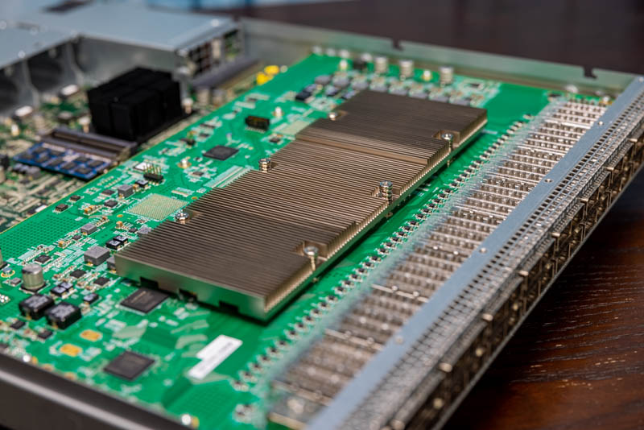
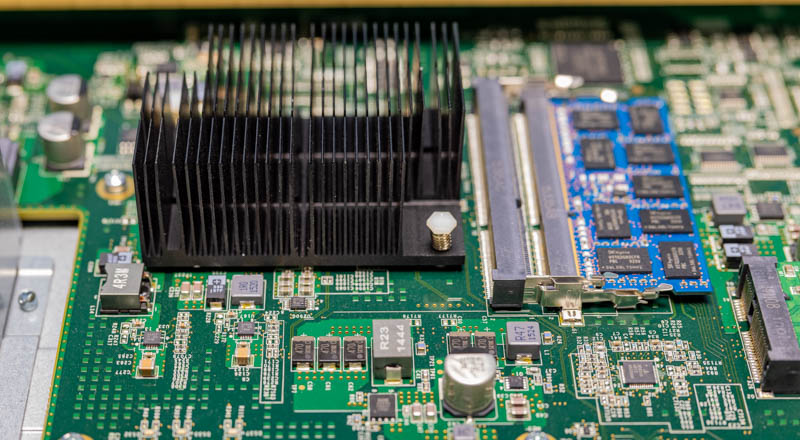
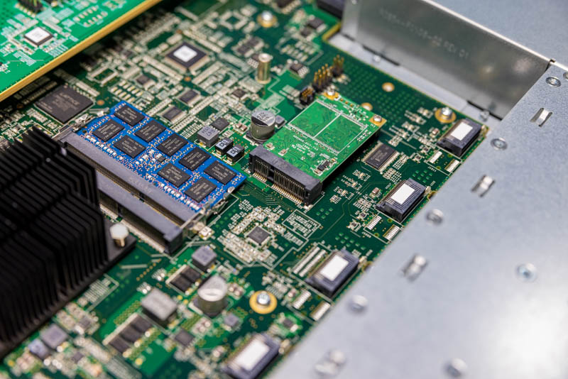
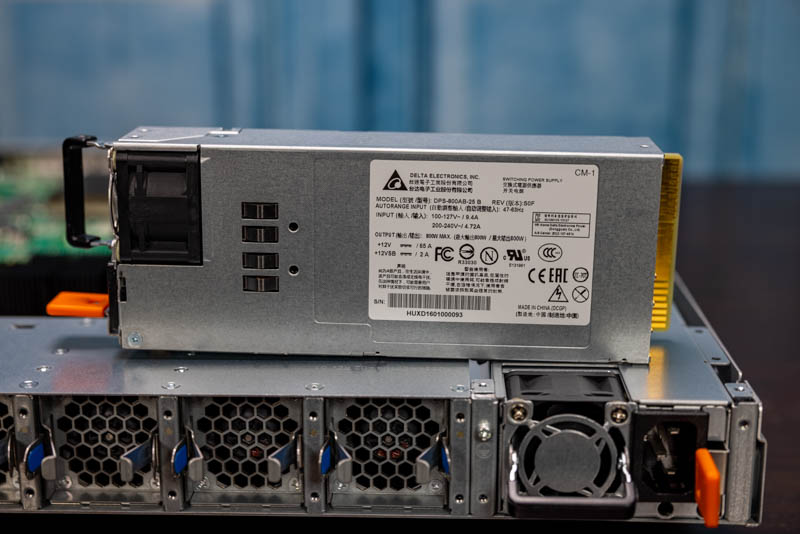

# Celestica Seastone DX010

## Overview

The Celestica Seastone DX010 is a 1U top-of-rack (ToR) data center switch with 32 QSFP28 ports, providing 3.2 Tbps of aggregate switching capacity. It is built around the Broadcom BCM56960 Tomahawk ASIC and is designed for open networking: the switch ships with ONIE (Open Network Install Environment) and supports network operating systems such as SONiC and ONL.

The DX010 belongs to the 100G generation of data center switches. Each of its 32 front-panel ports operates at 100 Gb/s using QSFP28 transceivers, and the ASIC supports flexible breakout configurations down to 25G or 10G per lane. This makes it suitable for both leaf-layer (server-facing) and spine-layer (aggregation) roles in spine–leaf data center fabrics.

| Attribute             | Value                                          |
| --------------------- | ---------------------------------------------- |
| Vendor                | Celestica                                      |
| Model                 | Seastone DX010                                 |
| Form Factor           | 1U rack-mount                                  |
| Switching ASIC        | Broadcom BCM56960 (Tomahawk I)                 |
| Front-Panel Ports     | 32x QSFP28 (100G each)                         |
| Total Throughput      | 3.2 Tbps                                       |
| Management CPU        | Intel Atom C2000 (Rangeley)                    |
| RAM                   | 4 GB DDR3 SODIMM (expandable)                  |
| Storage               | mSATA SSD                                      |
| Power Supplies        | 2x 800W Delta (redundant, hot-swappable)       |
| Cooling               | 5x hot-swappable fan modules, front-to-rear    |
| Software              | ONIE, SONiC, ONL                               |

## Physical Layout

### Front Panel

The front panel is divided into two zones:

| Zone   | Ports                                                                                  |
| ------ | -------------------------------------------------------------------------------------- |
| Center | 32x QSFP28 data ports (two rows of 16)                                                 |
| Right  | 1x RJ45 management, 1x RJ45 serial console, 1x USB Type-A, 1x SFP (management uplink)  |

The 32 QSFP28 cages in the center connect directly to the Tomahawk ASIC and carry all data-plane traffic. The management RJ45, console RJ45, USB, and SFP ports are wired to the Intel Atom management CPU and operate independently of the data path. The SFP cage provides an optional fiber-based out-of-band management link for environments where copper is impractical; it is not commonly used under SONiC.



### Rear Panel

The rear panel holds the two power supply bays on opposite sides and five hot-swappable fan modules in the center. The power supplies are placed on opposite ends to simplify A+B redundant power cabling in rack deployments. Each PSU has an orange ejector handle (release latch) that allows the unit to be unlatched and slid out under power for hot-swap replacement. The orange color is an industry convention for marking field-serviceable, hot-swappable components.



## Two-Board PCB Architecture

Internally, the DX010 uses a two-PCB design that physically separates the data plane from the control plane. Understanding this split is helpful context for the component sections that follow.



### Upper PCB: Data Plane (Switching Board)

The upper board carries the Broadcom Tomahawk ASIC and the 32 QSFP28 front-panel connectors. All 128 high-speed SerDes lanes are routed across this board from the centrally placed ASIC to the front-panel cages.

### Lower PCB: Control Plane (Management Board)

The lower board carries the management CPU complex (Intel Atom C2000), RAM, storage, power regulation, and fan/thermal management circuitry. This board is thinner and simpler because it handles only low-speed management traffic and I2C communication with the transceivers.

### Board Interconnect

The two boards connect via an internal board-to-board connector. The ASIC on the upper board communicates with the CPU on the lower board over a PCIe link, which the NOS uses to program forwarding tables, read counters, and manage the ASIC.

## ASIC-to-Port Signal Path

This section traces the physical path that serialized electrical signals take from the ASIC die to the front-panel QSFP28 cage. For background on differential signaling, SerDes operation, and signal integrity concepts referenced here, see [Digital Signal Fundamentals](03_signal_basics.md) and [Link Equalization and Training](04_signal_training.md).

Sources: the [ServeTheHome DX010 teardown](https://www.servethehome.com/inside-a-celestica-seastone-dx010-32x-100gbe-switch/) (board photos and observations), the Broadcom BCM56960 product listing (package type), and the QSFP28 MSA specification (cage electrical interface). Claims that go beyond these sources are marked explicitly.

### Step 1: SerDes Output (Inside the ASIC)

The BCM56960 contains 128 integrated SerDes lanes, each running at 25 Gb/s NRZ. After the forwarding pipeline selects an egress port, the packet data is serialized by the corresponding SerDes block into a high-speed electrical signal. Per the IEEE 802.3by standard that governs 25G Ethernet, each SerDes lane uses **differential signaling** — two complementary voltage waveforms (TX+ and TX−) that together represent one serial bitstream.

For a 100G QSFP28 port, four SerDes lanes drive four TX differential pairs simultaneously (4 × 25G = 100G). In the receive direction, four RX differential pairs carry data from the transceiver back to the ASIC.

### Step 2: BGA Package

The BCM56960 uses a **Ball Grid Array (BGA)** package (confirmed by the part number: BCM56960B1KFS**BG**, where "BG" denotes Ball Grid). The serialized differential signals exit the ASIC die, pass through the package substrate, and connect to the PCB via solder balls on the underside of the chip.

### Step 3: PCB Traces

From the BGA landing pads, the high-speed signals are routed across the upper PCB to the 32 QSFP28 cages on the front edge.

The ServeTheHome teardown makes two relevant observations about this board:

1. **The ASIC sits near the center of the board**, with the QSFP28 cages arrayed along the front edge (visible in the board photos).
2. **The upper PCB is unusually thick** — quote: *"The PCB this switch chip is on is very thick. If you are accustomed to most server or consumer motherboards, this is several times thicker than what you are used to. The reason is simple, it has to take 3.2Tbps of traffic from the switch chip to the QSFP28 connectors on the front of the switch."*

The thickness is needed because routing 128 differential pairs (256 signal traces) at 25 Gb/s requires a multi-layer PCB with controlled impedance, ground reference planes, and crosstalk isolation between adjacent lanes. The exact layer count of the DX010's upper PCB is not publicly documented.

### Step 4: Retimer

A **retimer** is a chip placed mid-path between the ASIC and the front-panel cage. It receives a degraded signal, recovers the clock and data, and retransmits a clean copy. Retimers are used when the PCB trace is long enough that the signal degrades beyond the receiver's ability to sample it reliably.

**Does the DX010 have retimers?** The ServeTheHome teardown of the upper PCB notes: *"The large heatsink one may first assume is for multiple ICs. Instead, it is simply there to cool the Broadcom Tomahawk chip."* No other active ICs between the ASIC and the QSFP28 cages are identified in the teardown photos or text. This is consistent with the absence of retimers, but the teardown does not explicitly confirm it. There is no public DX010 schematic to verify definitively.

For context: 25G NRZ signals are more tolerant of PCB trace loss than higher-speed PAM4 signals, and the distances inside a 1U chassis are short. Both factors reduce the need for retimers in this design.

### Step 5: QSFP28 Cage

At the front edge of the upper PCB, the traces terminate at 32 **QSFP28 cage connectors** — the metal receptacles visible on the front panel. Per the QSFP28 MSA specification, each cage provides a standardized electrical and mechanical interface: when a transceiver module is inserted, its edge connector mates with contacts inside the cage, connecting the four TX and four RX differential pairs from the PCB to the module's host-side interface.

### Step 6: Transceiver Module

Once the electrical signal reaches the module inside the cage, signal handling passes to the transceiver's internal circuitry:

- **Optical transceiver (e.g., 100G-SR4, 100G-LR4):** The module converts the electrical signal to optical and drives it into the fiber.
- **DAC cable (Direct Attach Copper):** No conversion occurs. The electrical signal passes through the module's passive copper twinax conductors to the remote end.
- **AOC cable (Active Optical Cable):** The module contains optics permanently attached to the cable, converting electrical to optical at each end.

For details on transceiver types and their operation, see `01_README_module.md` in project_3.

### Signal Path Summary

```
                   DX010 Signal Path (TX direction)

  ┌──────────────────────────────────────────────────────┐
  │  Tomahawk ASIC (BCM56960)                            │
  │  ┌──────────────┐                                    │
  │  │  SerDes       │  25G NRZ per lane                 │
  │  │  (128 lanes)  │  4 lanes per 100G port            │
  │  └──────┬───────┘                                    │
  └─────────┼────────────────────────────────────────────┘
            │  BGA solder balls (confirmed: BGA package)
  ══════════╪══════════════════════════════════════════════
  │         │         Upper PCB (Data Plane)              │
  │         │                                             │
  │    High-speed differential traces                     │
  │    (multi-layer PCB, exact layer count unknown)       │
  │         │                                             │
  │         │    No retimer ICs visible in teardown       │
  │         │                                             │
  │         ▼                                             │
  │  ┌──────────────┐                                     │
  │  │  QSFP28 Cage │  Per QSFP28 MSA specification       │
  │  └──────┬───────┘                                     │
  ══════════╪══════════════════════════════════════════════
            │
            ▼
  ┌──────────────────┐
  │ Transceiver      │  Optical module, DAC, or AOC
  │ Module           │
  └──────┬───────────┘
         │
         ▼
    Fiber or Copper to remote device
```

## Switching ASIC: Broadcom Tomahawk (BCM56960)

The BCM56960, marketed as Tomahawk (first generation), is a data center Ethernet switch SoC from Broadcom's StrataXGS product line. It is the specific NPU used in the DX010 and the component that performs all packet forwarding. Understanding this ASIC is essential because its capabilities and constraints define everything the switch can and cannot do.



### SerDes Lanes

The BCM56960 contains exactly 128 SerDes lanes at 25 Gb/s each (NRZ signaling). Each port macro controls four lanes and maps to one QSFP28 cage. This yields:

- **128 lanes total** — the full I/O budget of the chip
- **4 lanes per port** — each QSFP28 port bonds 4 lanes for 100G (4 × 25G)
- **32 port macros** — one per QSFP28 cage, each controlling 4 lanes

### Port Breakout

The DX010's 32 ports are all 100G QSFP28. Each port macro has 4 lanes at 25G NRZ. The BCM56960 supports the following breakout modes per cage:

| Breakout Mode | Logical Ports | Lanes per Logical Port | Speed per Logical Port |
| ------------- | ------------- | ---------------------- | ---------------------- |
| 1x 100G       | 1             | 4 (4 × 25G NRZ)        | 100G                   |
| 1x 40G        | 1             | 4 (4 × 10G NRZ)        | 40G                    |
| 2x 50G        | 2             | 2 (2 × 25G NRZ)        | 50G                    |
| 4x 25G        | 4             | 1 (1 × 25G NRZ)        | 25G                    |
| 4x 10G        | 4             | 1 (1 × 10G NRZ)        | 10G                    |

At maximum breakout (all 32 ports split to 4x25G), the switch exposes 128 logical ports at 25G each — still totaling 3.2 Tbps.

**BCM56960 constraint:** Within a single port macro, all four lanes must run at the same base signaling rate (all 25G NRZ or all 10G NRZ). Mixed lane rates within one cage are not supported. Each port macro is independently configurable: port 1 can be 1x100G while port 2 is 4x25G, because they use separate Falcon SerDes cores.

Always verify the platform's `hwsku` port configuration file and the available breakout modes (`show interfaces breakout`) before planning cable layouts.

### FEC Configuration

The BCM56960 supports two FEC modes:

| FEC Mode           | IEEE Clause | Algorithm         | Correction Strength | Latency   |
| ------------------ | ----------- | ----------------- | ------------------- | --------- |
| FC-FEC (Base-R)    | Clause 74   | FireCode          | Low (~1 error burst per frame) | ~50–100 ns |
| RS-FEC             | Clause 91   | Reed-Solomon      | High (corrects multi-symbol burst errors) | ~100–200 ns |

**RS-FEC (CL91)** is the standard for 100G Ethernet (IEEE 802.3bj). It uses an RS(528,514) code — for every 514 data symbols transmitted, 14 parity symbols are appended, allowing the receiver to correct substantial burst errors. This is the correct default for 100G QSFP28 links.

**FC-FEC (CL74)** is a simpler, older code originally designed for 10GBASE-KR. It has lower latency but weaker correction. It is occasionally used for 25G single-lane links where latency sensitivity outweighs error correction strength.

> For background on FEC principles, NRZ vs PAM4 requirements, and why both ends must match, see [Digital Signal Fundamentals — FEC](03_signal_basics.md#forward-error-correction-fec).

Recommended FEC settings by cable type:

| Cable / Optic Type          | Recommended FEC | Notes                                          |
| --------------------------- | --------------- | ---------------------------------------------- |
| Passive DAC (100G, ≤ 5m)   | RS-FEC (CL91)  | Almost always required; NICs often default to RS-FEC |
| Active Optical Cable (AOC)  | RS-FEC (CL91)  | May link without FEC on short runs, but RS-FEC adds margin |
| SR4 (100m multimode fiber)  | RS-FEC (CL91)  | Recommended; some work without at short distances |
| LR4 / CWDM4 (2–10 km)      | RS-FEC (CL91)  | Required for reliable operation over distance   |

FEC mode is configured per-port in SONiC via `config interface fec <interface> <mode>` or directly in the config DB. When troubleshooting a link that won't come up, verifying FEC match on both ends should be the first step after confirming the cable is seated.

### SONiC Interface Naming and Lane Mapping

The `show interfaces status` command in SONiC reveals how the 128 SerDes lanes are distributed across the 32 physical ports:

```text
admin@sonic:~$ show interfaces status
  Interface            Lanes    Speed    MTU    FEC    Alias    Vlan    Oper    Admin    Type    Asym PFC
-----------  ---------------  -------  -----  -----  -------  ------  ------  -------  ------  ----------
  Ethernet0      65,66,67,68     100G   9100     rs     Eth1  routed    down       up     N/A         off
  Ethernet4      69,70,71,72     100G   9100     rs     Eth2  routed    down       up     N/A         off
  Ethernet8      73,74,75,76     100G   9100     rs     Eth3  routed    down       up     N/A         off
 Ethernet12      77,78,79,80     100G   9100     rs     Eth4  routed    down       up     N/A         off
 Ethernet16      33,34,35,36     100G   9100     rs     Eth5  routed    down       up     N/A         off
...
Ethernet108      29,30,31,32     100G   9100     rs    Eth28  routed    down       up     N/A         off
Ethernet112  113,114,115,116     100G   9100     rs    Eth29  routed    down       up     N/A         off
Ethernet116  117,118,119,120     100G   9100     rs    Eth30  routed    down       up     N/A         off
Ethernet120  121,122,123,124     100G   9100     rs    Eth31  routed    down       up     N/A         off
Ethernet124  125,126,127,128     100G   9100     rs    Eth32  routed    down       up     N/A         off
```

**Key columns explained:**

| Column      | Meaning                                                                                                         |
| ----------- | --------------------------------------------------------------------------------------------------------------- |
| Interface   | SONiC's internal name. Numbered as `Ethernet<N>` where N increments by 4 (the lane count per port macro). Ethernet0 is the first port, Ethernet4 the second, Ethernet8 the third, etc. |
| Lanes       | The specific SerDes lane IDs (1–128) assigned to this port. Each 100G port shows exactly 4 lanes, confirming that one physical port = one 4-lane port macro.  |
| Speed       | The aggregate link speed — 100G here because all 4 lanes are bonded at 25G each.                                 |
| MTU         | Maximum transmission unit in bytes. 9100 is the SONiC default (jumbo frames).                                    |
| FEC         | Forward Error Correction mode. `rs` = Reed-Solomon (CL91), the default for 100G ports. Other values: `fc` (Firecode/CL74, common for 25G), `none`. FEC adds redundancy bits so the receiver can correct bit errors without retransmission — essential at 25 Gbaud NRZ signaling rates. |
| Alias       | The human-friendly front-panel label (Eth1–Eth32). This maps to the physical silkscreen on the chassis. SONiC uses `Interface` internally but displays `Alias` in some show commands for operator convenience. |
| Vlan        | Whether the port is `routed` (L3) or assigned to a VLAN (L2). Default is routed.                                |
| Oper/Admin  | Operational state (link detected or not) vs. administrative state (enabled or shut down by config).              |
| Type        | Transceiver type detected in the cage (N/A means no module inserted).                                            |
| Asym PFC    | Asymmetric Priority Flow Control — off by default; relevant for lossless RDMA configurations.                   |

**Why the lane numbers are not sequential across ports:** The Lanes column shows that Ethernet0 uses lanes 65–68, Ethernet4 uses 69–72, but Ethernet16 jumps to 33–36. Lane numbering reflects the physical wiring between the ASIC die and the QSFP28 cages on the PCB, which is determined by the board layout — not by front-panel order. The `hwsku` port configuration file (`port_config.ini` or `platform.json`) defines this mapping for each platform.

**The Ethernet<N> naming rule:** The number N is not arbitrary. It equals the port's *index* × the number of lanes per port macro. With 4 lanes per macro: port index 0 → Ethernet0, port index 1 → Ethernet4, port index 2 → Ethernet8, and so on up to port index 31 → Ethernet124. This convention ensures that when a port is broken out, the sub-ports slot neatly into the numbering gap (e.g., Ethernet0 broken into 4x25G becomes Ethernet0, Ethernet1, Ethernet2, Ethernet3).


### Forwarding Pipeline

The Tomahawk uses a four-core architecture. The 32 front-panel ports are divided among the four cores, with each core handling a subset of ports. Every packet entering any port passes through a three-stage forwarding pipeline:

1. **Ingress parsing and tunnel termination** — the packet is parsed, and any encapsulation (VXLAN, NVGRE, MPLS) is identified and terminated if needed.
2. **L2/L3 lookup** — the forwarding table is consulted for MAC learning, IP routing, or ECMP resolution.
3. **Egress processing** — the packet is queued, scheduled, and any required encapsulation or modification is applied before transmission.

Forwarding latency is approximately **500 ns** in standard L2/L3 mode. When configured for pure L2 switching with simplified processing, latency drops to approximately **300 ns**.

The pipeline reaches wire-rate (3.2 Tbps) for packet sizes of 250 bytes and above. Below that size, per-packet processing overhead reduces effective throughput.

### Forwarding Tables

The Tomahawk uses a **Unified Forwarding Table (UFT)** with 128K total entries. The entries are stored in shared memory banks that can be partitioned across different lookup types depending on the deployment profile:

| Profile  | Description                                                                                |
| -------- | ------------------------------------------------------------------------------------------ |
| Default  | 128K entries shared dynamically across L2 (MAC), L3 (LPM), and host (ARP/neighbor) lookups |
| Filter   | 8K L2 + 16K L3 LPM + 8K host + 64K ACL (fixed partitioning for ACL-heavy deployments)      |

This flexibility allows the same hardware to be tuned for L2-heavy environments (large MAC tables), L3-heavy environments (large routing tables), or security-heavy environments (large ACL sets).

### Packet Buffer

The BCM56960 provides **16 MB** of on-chip packet buffer, divided into four 4 MB pools (one per core). This buffer absorbs traffic bursts when output ports are temporarily congested. Each port is allocated buffer space from its core's pool, and the allocation can be tuned through memory management profiles in the NOS.

For context, 16 MB is modest by today's standards (newer 25.6T/51.2T ASICs use 64–256 MB), but it is sufficient for most data center ToR workloads where latency-sensitive traffic (such as RoCEv2) relies on PFC and ECN to prevent sustained queue buildup rather than deep buffering.

**Incast caveat:** Under many-to-one (incast) traffic patterns — common in storage clusters and distributed training — multiple senders simultaneously target a single 100G port. The 4 MB per-core buffer can exhaust in microseconds under such conditions. For RoCEv2 workloads on Tomahawk 1, lossless Ethernet tuning is not optional: PFC thresholds and ECN marking (DCQCN) must be precisely configured in SONiC. Without this, the shallow buffers will silently drop RDMA packets, causing go-back-N retransmissions that collapse effective throughput.

### Queuing

The ASIC provides **10 queues per port** for data traffic. These queues support strict priority scheduling, weighted round-robin, and WRED (Weighted Random Early Detection). Additionally, there are **48 CPU-bound queues** (between the ASIC and the management CPU) reserved for control-plane traffic such as LLDP, BGP, ARP, and LACP.

The 10-queue-per-port design is important for quality-of-service (QoS). In RoCEv2/RDMA deployments, dedicated queues are assigned to lossless traffic classes using Priority Flow Control (PFC), while best-effort traffic is placed in separate lossy queues.

### Thermal and Power

Broadcom does not publicly publish exact TDP figures for merchant silicon outside of NDA documentation. However, hardware engineering references and data center system analyses place the BCM56960 TDP at approximately **150–180 W**.

This heat is highly concentrated in two areas of the die: the central packet-processing pipelines (where all forwarding decisions execute at line rate) and the perimeter SerDes lanes (128 lanes, each running at 25 Gbps NRZ). The combination of concentrated heat flux and a large BGA package is why the chip requires the massive grooved metallic heatsink visible in teardown photographs — without sustained forced airflow from the fan tray, junction temperature would exceed safe limits within seconds.

### Supported Features

| Category              | Capabilities                                                        |
| --------------------- | ------------------------------------------------------------------- |
| **L2**                | MAC learning, VLANs, STP/RSTP, LAG/MLAG, LLDP                       |
| **L3**                | IPv4/IPv6 routing, ECMP, VRF, BGP, OSPF (in NOS)                    |
| **Overlay**           | VXLAN, NVGRE, MPLS (tunnel termination and encapsulation)           |
| **RDMA**              | RoCE v1, RoCEv2, PFC, ECN/DCQCN                                     |
| **Telemetry**         | BroadView (microburst detection, buffer monitoring, flow tracking)  |
| **SDN**               | OpenFlow 1.3+                                                       |
| **ACL**               | Ingress and egress ACLs, carved from UFT or dedicated TCAM          |

### Other Switches Using the BCM56960

The 128-lane budget of the BCM56960 maps naturally to 32 QSFP28 cages (4 lanes each), making 32x100G the canonical form factor. Nearly every commercial switch built on Tomahawk 1 shipped with this identical port layout:

| Switch           | Vendor         | Front-Panel Ports     |
| ---------------- | -------------- | --------------------- |
| Seastone DX010   | Celestica      | 32x QSFP28 (100G)     |
| AS7712-32X       | Edgecore       | 32x QSFP28 (100G)     |
| Wedge 100        | Facebook / OCP | 32x QSFP28 (100G)     |
| 7060CX-32S       | Arista         | 32x QSFP28 (100G)     |

While the ASIC can theoretically drive 64 ports at 50G or 128 ports at 25G, no vendor productized those configurations. The 100G market was the target, and lower speeds (25G, 10G) are already reachable via per-port breakout on the same 32-cage platform. Dedicated 25G SFP28 switches (e.g., 48x25G + uplinks) were served by cheaper ASICs in Broadcom's Trident family, making a 128-port TH1 design commercially pointless.


## Management CPU: Intel Atom C2000 (Rangeley)

The management CPU is an Intel Atom C2000-series processor (codename Rangeley). This is a low-power x86 processor that runs the network operating system. It does not participate in packet forwarding — all data-plane switching is handled by the Tomahawk ASIC at wire speed. The CPU's role is exclusively control-plane:

- Running the NOS (SONiC, ONL, etc.)
- Executing routing protocols (BGP, OSPF) and computing forwarding tables
- Programming the ASIC's forwarding tables via Broadcom's SAI (Switch Abstraction Interface) or SDK
- Handling management traffic (SSH, SNMP, REST API)
- Communicating with transceivers over I2C (reading DOM data, controlling TX disable)
- Monitoring temperature sensors, fan speeds, and PSU status



### AVR54 Bug (Intel Atom C2000 Defect)

Early steppings of the Intel Atom C2000 (different from the fixed C0 stepping shipped from mid-2017 onward) contain a silicon defect known as AVR54. This bug causes the clock signal output from the LPC (Low Pin Count) bus to gradually degrade over time. Eventually the degradation reaches a point where the processor can no longer boot.

The failure is sudden and permanent: the switch works normally until one day it fails to power on after a reboot or power cycle. There is no warning and no software workaround.

To check whether a DX010 has the fixed silicon:

```
setpci -s 00:00.0 8.w
```

If the result is `0003`, the unit has the C0 stepping (bug fixed). Any other value indicates the affected stepping.

### Memory and Storage

- **RAM:** DDR3 SODIMM slot, typically populated with 4 GB (SK Hynix). A second SODIMM slot is available for expansion. 4 GB is adequate for SONiC; 8 GB provides additional headroom.
- **Storage:** mSATA SSD for the NOS image and configuration persistence.



### Platform Management: CPLDs, No BMC

The DX010 does not have a Baseboard Management Controller (BMC). All platform management — fan speed control, thermal monitoring, PSU status, LED state — is handled by CPLDs on the management board, accessed over I2C from the main CPU running the NOS.

This means there is no independent out-of-band management processor. If the NOS crashes or the CPU hangs, no separate controller can monitor thermals or initiate a safe shutdown. The CPLDs continue driving the fans at their last commanded speed, but there is no intelligent failsafe beyond that.

The successor platform, the Seastone2 DX030, adds an optional BMC with IPMI 2.0, Serial over LAN, NC-SI shared management port, and remote firmware upgrade — a fully independent management plane that operates regardless of NOS state.


## Power Supplies

The DX010 uses two hot-swappable 800W Delta DPS-800AB-16 A power supply units. The two PSUs provide 1+1 redundancy: either PSU can power the entire switch alone if the other fails or is removed for service.



The 800W rating per PSU is the maximum capacity, not the typical draw. Under normal operation with DAC cables or low-power optics, the switch consumes approximately **150–200W** total. The high PSU rating exists to support worst-case scenarios: all 32 ports populated with high-power long-reach optical transceivers (such as LR4 or ER4 modules), which can each draw 3–5W.


## Power Consumption

Celestica does not publish official power draw figures for the DX010. However, system-level consumption can be estimated from the known power characteristics of each subsystem.

### Power Contributors

The total power draw of the switch is the sum of five subsystems:

| Subsystem              | Description                                         | Typical Power    |
| ---------------------- | --------------------------------------------------- | ---------------- |
| Switching ASIC         | Broadcom BCM56960 (Tomahawk I), 28 nm, 3.2 Tbps    | 150–180 W (TDP) |
| Transceivers           | QSFP28 modules (per port, depends on optic type)    | 3.5–5.0 W each  |
| Management CPU         | Intel Atom C2000 (Rangeley), dual-core              | 10–20 W          |
| Cooling                | 5x high-speed fan modules                           | 15–30 W          |
| Miscellaneous          | PCB voltage regulators, PHYs, SSD, RAM              | 5–15 W           |

The switching ASIC is the dominant consumer. Its power draw scales with the number of active SerDes lanes, traffic volume, and table utilization. At idle the chip still maintains clocks, PLLs, and SerDes bias, drawing roughly 100–120 W. Under sustained line-rate traffic across all 32 ports, it approaches the full 150–180 W TDP envelope.

Transceiver power depends on the optic type inserted. Common QSFP28 modules:

| Optic Type   | Reach     | Power per Module |
| ------------ | --------- | ---------------- |
| SR4          | 100 m     | 3.5 W            |
| CWDM4        | 2 km      | 3.5–4.5 W        |
| LR4          | 10 km     | 4.0–5.0 W        |
| DAC cable    | ≤ 5 m     | < 0.5 W          |

A fully populated switch with 32 LR4 optics adds ~150 W from transceivers alone; a lab setup with a few DAC cables adds almost nothing.

### Estimated System Power by Scenario

| Scenario                                   | Estimated Wall Power |
| ------------------------------------------ | -------------------- |
| Idle (no transceivers, no traffic)         | 150–170 W            |
| Light lab use (4–8 DAC ports, low traffic) | 160–190 W            |
| Typical DC (16 ports, SR4, moderate load)  | 250–300 W            |
| Full load (32x LR4, line-rate traffic)     | 370–420 W            |

These are AC wall-draw estimates that include PSU conversion losses (~10–15 % at partial load for an 80 PLUS Platinum-class supply like the Delta DPS-800AB).

### Implications for Home Lab Use

- A single 800 W PSU is more than sufficient for any realistic workload; the second PSU provides redundancy, not additional capacity.
- At idle the switch draws roughly what a mid-range desktop PC does (~150 W). Expect a monthly electricity cost of approximately $15–20 at US residential rates (assuming ~$0.15/kWh, 24/7 operation).
- Fan noise and power both increase under thermal load. In a quiet home environment with few or no optics, replacing the high-speed Nidec fans with quieter aftermarket models is a common modification (at the cost of reduced thermal headroom).

## Software Ecosystem

The DX010 is an **open networking** switch. It ships with ONIE, which is a boot loader environment that allows operators to install any compatible NOS. The most common choices are:

| NOS   | Description                                                                                          |
| ----- | ---------------------------------------------------------------------------------------------------- |
| SONiC | Open-source NOS originally developed by Microsoft for Azure. Supports BGP, ECMP, VXLAN, PFC, RDMA.   |
| ONL   | Open Network Linux — a minimal Linux distribution for bare-metal switches.                           |

SONiC communicates with the Tomahawk ASIC through the **SAI (Switch Abstraction Interface)**, which provides a vendor-neutral API for programming forwarding tables, ACLs, QoS policies, and reading counters. Broadcom provides the SAI implementation for the BCM56960 as part of their SDK (OpenNSA / SDKLT).

This software model means the DX010 has no vendor-locked CLI. All configuration is done through SONiC's config DB, CLI (`show`, `config`), or REST/gNMI interfaces.

### SONiC Support Lifecycle

Tomahawk 1 was the pioneering ASIC for SONiC development, and Broadcom's community SAI still supports it. However, active development in upstream SONiC increasingly targets Tomahawk 3, 4, and 5. Newer features (such as advanced telemetry, SRv6, or certain hardware offloads) may not be backported to the BCM56960 SAI layer. For production stability on the DX010, it is advisable to pin to a well-tested SONiC release branch (such as 202211 or 202305) rather than tracking the `master` branch, where regressions on first-generation hardware are more likely to occur unnoticed.

## References

- [Inside a Celestica Seastone DX010 32x 100GbE Switch — ServeTheHome](https://www.servethehome.com/inside-a-celestica-seastone-dx010-32x-100gbe-switch/) (teardown photos and analysis)
