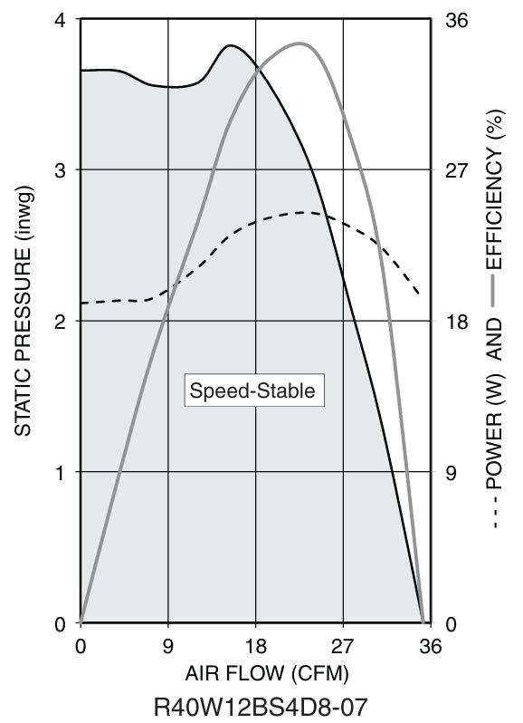
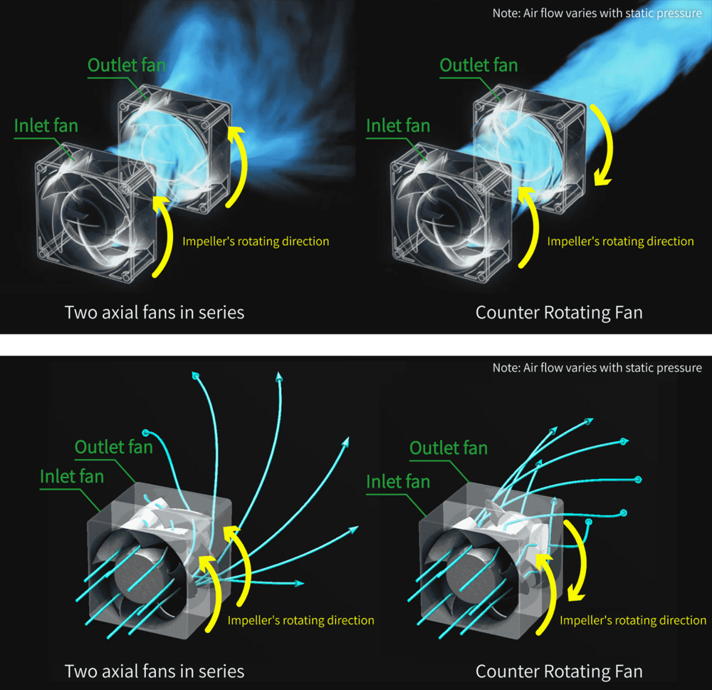
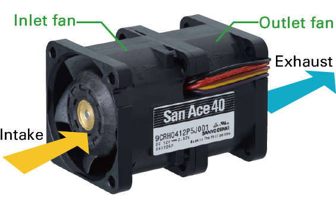
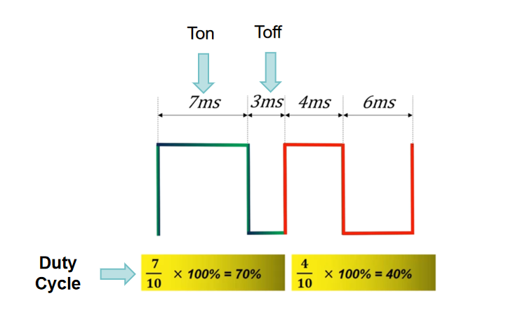
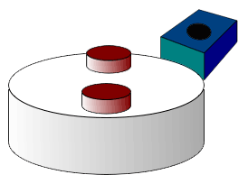
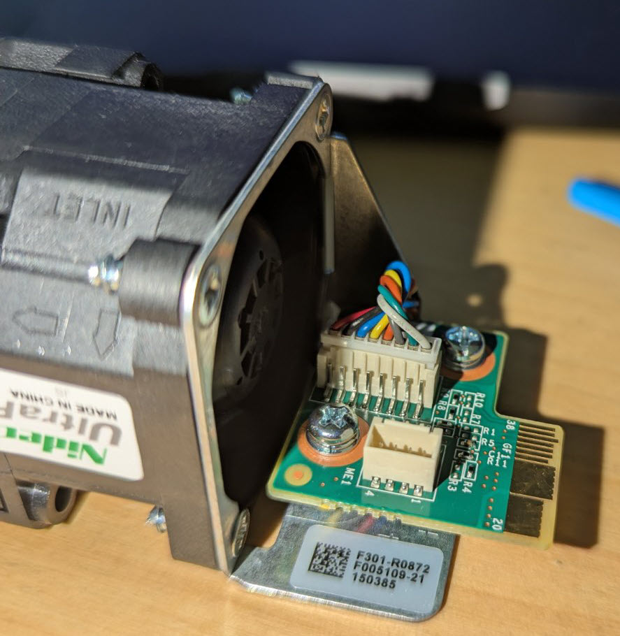
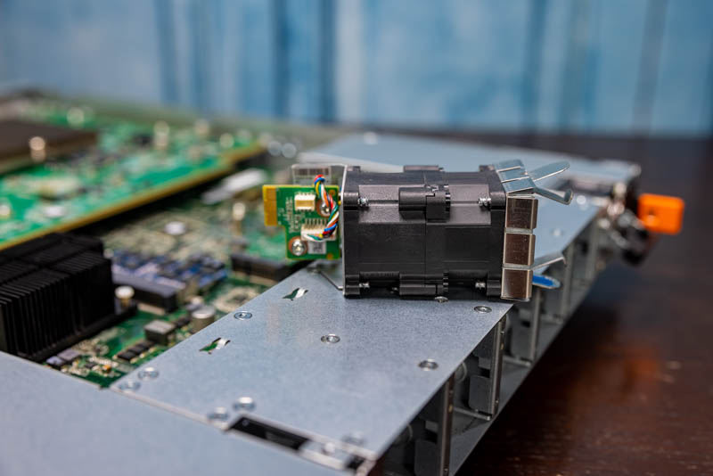

# DX010 Cooling

## The Thermal Challenge

The DX010 is a 1U chassis that dissipates approximately 150–200 W in typical operation, with the Tomahawk ASIC alone accounting for 150–180 W TDP. All of this heat is concentrated in a volume roughly 44 cm wide × 43 cm deep × 4.4 cm tall. Without forced airflow, the ASIC junction temperature would exceed safe limits within seconds of powering on.

The primary difficulty is not moving a large volume of air — it is pushing that air through a highly restrictive path. Inside the chassis, airflow must pass through dense heatsink fins, tightly packed PCBs, cable bundles, and up to 32 QSFP28 optical modules. This resistance to airflow is called **impedance**, and overcoming it requires fans that generate high **static pressure** rather than simply high volume.

## Airflow Direction

The DX010 uses **C2P (Connector-to-Power, front-to-rear)** airflow: cool air enters through the QSFP28 front panel, passes over the PCBs and ASIC heatsink, and exhausts through the rear fans. This means the port side must face the cold aisle when installed in a data center rack.

> For a full explanation of hot-aisle / cold-aisle containment, C2P vs P2C airflow variants, and rack orientation rules, see the [Data Center Fundamentals](https://github.com/ManiAm/DC-Fundamentals/blob/master/docs/01_README_DC.md#cooling-the-data-center) documentation.

## Static Pressure vs Airflow

Fan performance is described by two related quantities:

- **Airflow** — the volume of air the fan moves, measured in CFM (cubic feet per minute).
- **Static pressure** — the fan's ability to push air against resistance, measured in inches of water column (inH₂O) or Pascals (Pa).

In an open environment with no obstructions, a fan operates near its maximum airflow (right side of the curve). As internal resistance increases (heatsinks, filters, dense PCBs), the operating point shifts left — airflow drops and the fan must generate more static pressure to maintain useful air movement.



The chart above is from the R40W12BS4D8-07 datasheet. The **solid black line** is the PQ curve (static pressure vs airflow): it starts at ~3.6 inH₂O at zero flow and drops to zero at ~35 CFM free-air. The **dashed line** shows power consumption (peaks ~25 W at mid-flow). The **gray line** shows aerodynamic efficiency (peaks around 18 CFM).

High-density network switches operate on the **left** portion of this curve — the high-impedance region where airflow is restricted but static pressure demand is high. This is why they require fan designs optimized for static pressure rather than the high-airflow, low-pressure fans found in desktop PCs.

## Counter-Rotating Fan Design

A single axial fan imparts both forward velocity and rotational spin (swirl) to the air. The swirl component is wasted energy — it does not contribute to pushing air through the chassis and instead dissipates as turbulence downstream.

A **counter-rotating fan assembly** places two rotors in series, spinning in opposite directions. The second rotor intercepts the swirling airflow from the first rotor, cancels the rotational component, and converts that recovered energy into additional forward pressure. The result is significantly higher static pressure than a single rotor of the same size and power — which is why virtually every 1U network switch uses counter-rotating fans.



### DX010 Dual-Stage Implementation

Each **fan module** in the DX010 is a hot-swappable unit containing two independent rotor stages stacked front-to-back within a single housing:



- **Inlet stage (first rotor)** — draws air into the module and accelerates it forward. The exiting air has both axial (forward) and tangential (swirl) velocity components.
- **Outlet stage (second rotor)** — spins in the opposite direction, recovering the swirl energy and converting it into additional forward static pressure.

Each stage is an independent motor with its own power, PWM control, and tachometer feedback — allowing the system to monitor and control each rotor independently.


## Pulse Width Modulation (PWM)

PWM is the method used to control fan speed. Instead of varying the supply voltage, the controller sends a high-frequency digital signal that rapidly switches between ON and OFF states.

The proportion of time the signal remains ON during each cycle is called the **duty cycle**:

- 100% duty cycle → full power, maximum speed
- 50% duty cycle → half the effective power, reduced speed
- 0% duty cycle → motor off



The switching frequency is typically 25 kHz — fast enough that the motor's rotational inertia smooths the pulses into continuous rotation rather than intermittent motion.

Most fan controllers use an 8-bit PWM register (values 0–255). Converting a percentage to a register value:

    PWM_register = round(duty_percent × 255 / 100)

### Duty Cycle vs Speed Curve

The relationship between duty cycle and fan speed is approximately linear once the motor exceeds its startup threshold. At very low duty cycles, the motor lacks sufficient torque to overcome bearing friction and remains stationary. Once past this threshold, RPM increases proportionally with duty cycle up to the maximum rated speed.

Thermal management algorithms exploit this predictable relationship to dynamically match fan speed to measured temperatures.

## Tachometer

A tachometer (tach) signal provides real-time feedback on the fan's actual rotational speed (RPM). Without this feedback, the system has no way to confirm the fan is actually spinning — PWM alone is merely a command, not a guarantee of mechanical response.

### How It Works

Modern brushless DC (BLDC) fans contain Hall-effect sensors that detect the rotor's magnetic field as it rotates. The fan's internal controller uses these sensors for electronic commutation (energizing the correct windings at the correct time). As a byproduct, it generates a digital pulse on the tach wire — typically two pulses per revolution (varies by design).



The tach output is usually an open-collector signal: the system provides a pull-up resistor, and the fan periodically pulls the line low to generate pulses. The platform controller counts pulses over time to calculate RPM.

### Why Tach Matters

PWM commands a speed; tach verifies it. If a fan stalls due to bearing failure, obstruction, or insufficient duty cycle, the tach signal drops to zero while PWM remains active. Without tach feedback, the system would be unaware that airflow has stopped. By comparing commanded speed (PWM) against measured speed (tach RPM), the controller detects:

- Stalled fans (RPM = 0 despite nonzero PWM)
- Degraded bearings (RPM lower than expected for given duty cycle)
- Unexpected speed variations (mechanical or electrical fault)

The platform software responds by increasing duty cycle on remaining fans, raising alarms, logging faults, or initiating protective thermal shutdown.

## Fan Wire Configuration

Each fan module contains two independent motors (inlet and outlet stages), each requiring its own set of wires for power, control, and monitoring:

| Function      | Inlet Fan (Stage 1) | Outlet Fan (Stage 2) |
| ------------- | ------------------- | -------------------- |
| Power (+)     | Red ×2              | Orange ×2            |
| GND (-)       | Black ×2            | Gray ×2              |
| Control (PWM) | Blue ×2             | Green ×2             |
| Sensor (Tach) | Yellow ×2           | White ×2             |



The doubled wires per function provide redundant current paths for reliability. Each stage's PWM and tach lines are independent, allowing the platform controller to command and monitor the inlet and outlet rotors separately.

## Fan Modules and Redundancy

The DX010 uses five fan modules in an **N+1 redundancy** configuration: the system can maintain safe operating temperatures with one module completely failed or removed. Fan modules are hot-swappable, so a failed unit can be replaced without powering down the switch. When a failure is detected, the remaining four modules increase speed to compensate for the lost airflow until the faulty module is replaced.

During hot-swap replacement, the chassis temporarily operates with reduced cooling capacity. The thermal management daemon increases the remaining fans to maximum speed and monitors temperatures continuously until the replacement module is inserted and confirmed operational.

## DX010 Fan Module Specifications

Each of the five fan modules in the DX010 contains a **Nidec UltraFlo R40W12BS4D8-07A581**:

| Spec | Value |
|------|-------|
| Type        | Dual In-Line Counter-Rotating (DICR) |
| Dimensions  | 40 × 40 × 56 mm |
| Voltage     | 12 VDC |
| Max Current | 3.8 A |
| Max Power   | 25.2 W |
| Max Airflow | 35 CFM |
| Max Static Pressure | 3.8 inH₂O |
| Speed (inlet / outlet) | 21,400 / 22,100 RPM |
| Noise          | 68.0 dBA |
| Operating Temp | -10 to +70 °C |
| Life (L10)     | 70,000 hours (~8 years) |
| Bearings       | Permanently Lubricated Dual Ball |
| Control        | Speed-Stable (feedback-governed PWM) |

The `-A581` suffix is Celestica's customer-specific ordering code; base specs match the standard R40W12BS4D8-07 datasheet.



The small PCB visible on each module carries the tachometer feedback and PWM control lines for both stages. These connect to the management board's fan CPLD, which reports RPM and accepts speed commands over I2C from the NOS.

## Thermal Management in SONiC

The fan speed is managed by SONiC's `thermalctld` daemon (part of the platform monitor container). This daemon continuously reads temperature sensors on the ASIC, CPU, and ambient board zones, and adjusts fan PWM duty cycles according to a thermal policy defined in the platform configuration.

On newer SONiC builds (202012+), fan status can be inspected with `show platform fan`. SONiC uses the term **drawer** to refer to a fan module. Each drawer contains two rotors and appears as two rows in the output — one for the front/inlet rotor (F) and one for the rear/outlet rotor (R).

```bash
admin@sonic:~$ show platform fan

  Drawer    LED          FAN    Speed    Direction    Presence    Status          Timestamp
--------  -----  -----------  -------  -----------  ----------  --------  -----------------
 Drawer1  green       FAN-1F      51%       intake     Present        OK  20260523 11:35:48
 Drawer1  green       FAN-1R      51%       intake     Present        OK  20260523 11:35:49
 Drawer2  green       FAN-2F      51%       intake     Present        OK  20260523 11:35:49
 Drawer2  green       FAN-2R      51%       intake     Present        OK  20260523 11:35:49
 Drawer3  green       FAN-3F      50%       intake     Present        OK  20260523 11:35:49
 Drawer3  green       FAN-3R      50%       intake     Present        OK  20260523 11:35:49
 Drawer4  green       FAN-4F      50%       intake     Present        OK  20260523 11:35:49
 Drawer4  green       FAN-4R      51%       intake     Present        OK  20260523 11:35:49
 Drawer5  green       FAN-5F      50%       intake     Present        OK  20260523 11:35:49
 Drawer5  green       FAN-5R      50%       intake     Present        OK  20260523 11:35:49
     N/A  green  PSU-1 FAN-1      49%      exhaust     Present        OK  20260523 11:35:49
     N/A  green  PSU-2 FAN-1      56%      exhaust     Present        OK  20260523 11:35:49
```

**Reading the output:**

| Column | Meaning |
| ------ | ------- |
| Drawer | Physical fan module (Drawer1–Drawer5 in SONiC output). PSU fans show N/A. |
| LED | Green = healthy, Red = fault or missing. |
| FAN | Logical fan name. Each module has two entries: F (front/inlet rotor) and R (rear/outlet rotor). |
| Speed | Current duty cycle as percentage of maximum. |
| Direction | Describes the fan's rotational perspective, not the overall chassis airflow. The DX010 is always C2P (front-to-rear) regardless of whether this field shows `intake` or `exhaust`. The labeling varies across SONiC versions and platform driver updates. |
| Presence | Whether the module is physically inserted. |
| Status | OK or fault condition. |

The PSU entries (`psu1_fan1`, etc.) are internal fans within the power supply units — these are separate from the five chassis fan modules and are managed independently by the PSU's own controller.

If a fan module fails (Status = Not OK or Presence = Not Present), the NOS logs the event, sets the module LED to red, and increases the remaining fans to compensate.
