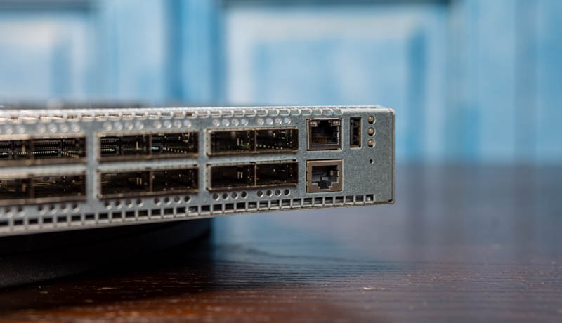

# DX010: Physical Setup and Initial Access

This guide covers the physical cabling and initial software access for the Celestica Seastone DX010.

## Prerequisites

### Equipment Needed

| Item                                           | Purpose                    |
| ---------------------------------------------- | -------------------------- |
| DX010 switch                                   | The switch itself |
| 2x AC power cables (C13-to-C14 or C13-to-wall) | Power to the two PSUs |
| Serial console cable                           | Serial access to the management CPU |
| RJ45 Ethernet cable                            | Out-of-band management network connection |
| QSFP28 DAC cables or optical transceivers      | Data-plane connections to servers or other switches |
| Laptop or workstation with a terminal emulator | Serial console and SSH access |
| Rack or stable surface                         | Physical mounting |

The DX010 ships with an RJ45-to-DB9 serial console cable. Most modern laptops lack a DB9 serial port, so you will likely need a **USB-to-DB9** adapter to connect the included cable to your workstation.

### Terminal Emulator Software

This guide uses `picocom` for serial console access. Install it if needed:

```bash
sudo apt install picocom
```

On macOS, `picocom` is available via Homebrew (`brew install picocom`). On Windows, use PuTTY or Tera Term in serial mode.


## Step 1: Rack and Power

### Mount the Switch

The DX010 is a 1U rack-mount chassis. If using a rack, install the rails and slide the switch into position. If using a bench, place the switch on a flat, stable surface with at least 15 cm of clearance at both the front (air intake) and rear (exhaust) to allow proper airflow.

### Connect Power Cables

The DX010 has two 800W Delta power supply units on opposite ends of the rear panel. Each PSU has a standard IEC C14 inlet.

1. Connect a power cable to **PSU 1** (left side of rear panel).
2. Connect a power cable to **PSU 2** (right side of rear panel).

Using both PSUs provides 1+1 redundancy: either PSU can power the entire switch alone. For lab use, a single PSU is sufficient, but both are recommended for reliability.

Under normal operation with DAC cables or low-power optics, the switch draws approximately **150–200W total**. The 800W PSU rating covers worst-case scenarios with all 32 ports populated with high-power long-reach optics.

### Verify Fans

Before powering on, confirm all five fan modules are seated in the rear panel. Push each module firmly into its slot until the latch engages. Missing or unseated fan modules will cause thermal alarms and potentially automatic shutdown.

### Power On

There is no discrete power button on the DX010. The switch powers on automatically when AC power is applied to at least one PSU. You will hear the fans spin up immediately. During early boot, the CPLD runs a lamp test: all front-panel port LEDs briefly light green to verify they are functional, then turn off. Once SONiC finishes booting and the `ledd` daemon takes over, the LEDs reflect actual link status (green = link up, off = no link).


## Step 2: Serial Console Connection

The serial console is the **first and most reliable** way to access the switch. It works regardless of network configuration, IP addressing, or whether SONiC has booted correctly. You must establish serial access before doing anything else.

### Identify the Serial Console Port

On the right side of the front panel, next to the 32 QSFP28 data ports, there are two RJ45 jacks stacked vertically. The **upper** RJ45 is the management Ethernet port. The **lower** RJ45 is the serial console port. Do not confuse the two.



### Connect the Cable

1. Plug the RJ45 end of the console cable into the serial console port on the switch.
2. Plug the other end (USB or DB9) into your workstation.
3. Identify the serial device on your workstation:
   - **Linux:** `ls /dev/ttyUSB*` (typically `/dev/ttyUSB0`)
   - **macOS:** `ls /dev/tty.usbserial-*`
   - **Windows:** Check Device Manager → Ports (COM & LPT) for the COM port number

### Configure Terminal Settings

Use the following serial parameters (from the [Celestica SONiC User Manual](https://www.celestica.com/uploadedFiles/Site/our-expertise/hardware-platform-solutions/celestica-documentation-portal/SONiC_User_Manual.pdf)):

| Parameter    | Value  |
| ------------ | ------ |
| Baud rate    | 9600   |
| Data bits    | 8      |
| Stop bits    | 1      |
| Parity       | None   |
| Flow control | None   |

Connect using `picocom`:

```bash
sudo picocom -b 9600 /dev/ttyS0
```

> Use `/dev/ttyS0` for a native DB9 serial port, or `/dev/ttyUSB0` if using a USB-to-serial adapter. Run `sudo dmesg | grep tty` to identify your device.

> **Baud rate note:** On the DX010, the serial console operates at **9600** baud across all tested SONiC versions (2018 through 202405). The Celestica user manual references 115200, but the actual BIOS/GRUB configuration on this platform uses 9600. If picocom connects but you see garbled output, try `-b 115200` as a fallback. You can verify the active baud rate over SSH with `sudo cat /proc/cmdline` and checking the `console=ttyS0,<baud>` parameter.

> To exit picocom, press **Ctrl+A** then **Ctrl+X**.

### Observe Boot Output

Once the serial connection is established and the switch is powered, you will see boot output on the terminal:

1. **ONIE GRUB menu** — appears first, listing options such as the installed SONiC image, ONIE Install OS, ONIE Rescue, etc.
2. **Linux kernel boot messages** — after the SONiC image is selected (automatically after a timeout or manually).
3. **SONiC login prompt** — appears when the system has fully booted.

If the switch was already powered on before you connected the serial cable, press **Enter** to get a login prompt.

### Log In

Default SONiC credentials (from the [SONiC documentation](https://github.com/sonic-net/SONiC/blob/master/doc/user-manual/SONiC-User-Manual.md) and [Celestica documentation](https://documentationportal.celestica.com/en/software/sonic/user-manual/login-username-and-password/default-login)):

| Field | Value |
| ----- | ----- |
| Username | `admin` |
| Password | `YourPaSsWoRd` |

After logging in, change the default password immediately:

```
passwd
```


## Step 3: Initial Health Checks

These checks should be performed before connecting any data cables.

### Check the Intel Atom C2000 Stepping (AVR54 Bug)

Early steppings of the Intel Atom C2000 have a silicon defect (AVR54) that causes the CPU to fail permanently after extended use.

```
sudo setpci -s 00:00.0 8.w
```

- **`0003`** — C0 stepping. Bug is fixed. Safe to use.
- **Any other value** — affected stepping. The switch may fail to boot after a future power cycle.

### Check SONiC Version

```
show version
```

Note the `SONiC Software Version` and `HwSKU` fields. The HwSKU should show `Seastone-DX010`. If the version is old, [plan an upgrade](#step-5-sonic-image-upgrade).

### Check Platform Health

```
show platform summary
show platform psustatus
show platform fan
show platform temperature
```

Verify that both PSUs show "OK", all five fans are detected and running, and temperatures are within normal range.


## Step 4: Management Ethernet Connection

The management Ethernet port provides out-of-band network access to the switch (SSH, SCP, HTTP). It connects to the management CPU, not to the switching ASIC — it is completely independent of the 32 QSFP28 data ports.

### Connect the Cable

Plug a standard RJ45 Ethernet cable into the **management Ethernet port** on the front panel (labeled "MGT" or "Management", next to the serial console port). Connect the other end to your management network (a switch, router, or directly to your workstation).

### Check for DHCP Address

By default, SONiC configures the management interface (`eth0`) as a DHCP client. If your network has a DHCP server, the switch may already have an IP address:

```
/sbin/ifconfig eth0
```

If an IP address is shown, you can SSH to the switch from your management network:

```bash
ssh admin@<ip-address>
```

### Configure a Static IP (If No DHCP)

If there is no DHCP server on your management network, assign a static IP via the serial console:

```
sudo config interface ip add eth0 <ip-address>/<prefix-length> <gateway>
```

Example:

```
sudo config interface ip add eth0 192.168.1.100/24 192.168.1.1
```

Save the configuration so it persists across reboots:

```
sudo config save -y
```

Verify:

```
/sbin/ifconfig eth0
```

You should now be able to SSH to the switch from your management network.


## Step 5: SONiC Image Upgrade

If the switch is running an old SONiC version, upgrade to a current release. The DX010 uses the **Broadcom** platform image.

**Tested branches on DX010:**

| Branch | Kernel | Debian | DX010 Status |
|--------|--------|--------|--------------|
| 202311 | 5.10   | 11 (Bullseye) | Tested and working |
| 202405 | 6.1    | 12 (Bookworm) | Tested and working  |
| 202411 | 6.1    | 12 (Bookworm) | Expected to work (same kernel series as 202405); not yet tested |
| 202505 | 6.12   | 13 (Trixie)   | Crashes — `dx010_cpld` driver incompatible with kernel 6.12 Fortify checks |
| 202511 | 6.12   | 13 (Trixie)   | Crashes — same CPLD driver issue |

### Find the Image

The DX010 platform identifier in SONiC is `x86_64-cel_seastone-r0`. Download the Broadcom image (`sonic-broadcom.bin`) for your target SONiC release from the [SONiC build page](https://sonic-build.azurewebsites.net/ui/sonic/Pipelines) or from Celestica support.

To build SONiC from source instead of downloading a prebuilt image, see [Sonic_Build.md](Sonic_Build.md).

### Transfer and Install

**Option A — Download directly on the switch:**

```bash
curl -L -o /home/admin/sonic-broadcom.bin "https://sonic-build.azurewebsites.net/api/sonic/artifacts?branchName=xxx"
```

**Option B — Transfer from your workstation:**

```bash
scp sonic-broadcom.bin admin@<switch-ip>:/home/admin/
```

Then install on the switch:

```
sudo sonic-installer install /home/admin/sonic-broadcom.bin
```

### Reboot

```
sudo reboot
```

The SSH session will disconnect immediately. The serial console remains active through the reboot, allowing you to watch the full boot sequence and catch any errors.

After reboot, verify the new version:

```
show version
```


## Step 6: Data Cable Connections

The 32 QSFP28 ports on the front panel are the data-plane ports. They carry forwarded traffic at wire speed through the Broadcom Tomahawk ASIC. These ports are independent of the management Ethernet port.

### Choose Your Cable Type

| Cable Type | Use Case | Notes |
| ---------- | -------- | ----- |
| QSFP28 DAC (Direct Attach Copper) | Short reach, same rack (1–5 m) | Passive, no optics, lowest cost and power |
| QSFP28 AOC (Active Optical Cable) | Medium reach (5–30 m) | Active, optical, fixed cable+optics |
| QSFP28 optical transceiver + fiber | Long reach or structured cabling | Separate transceiver module + LC or MPO fiber patch cord |

For a lab environment with servers in the same rack, **QSFP28 DAC cables** are the simplest and most cost-effective option. They plug directly into both the switch's QSFP28 cage and the server NIC's QSFP28 port.

### Insert Cables or Transceivers

- **For DAC/AOC cables:** Insert one end into a QSFP28 port on the DX010 and the other end into the server NIC (e.g., Mellanox ConnectX-4/5/6). The cable clicks into the cage when fully seated. To remove, pull the tab or latch on the cable connector.

- **For optical transceivers:** Insert the QSFP28 transceiver module into the cage first (it clicks when seated), then connect the fiber patch cord to the transceiver's LC or MPO connector.

> **Single-end detection:** Each end of a DAC/AOC cable has its own EEPROM and ModPrsL (module presence) pin. Plugging just one end into the switch is enough for the CPLD to detect the module and for SONiC to read its EEPROM (vendor, part number, serial, etc.). The front-panel port LED will not light up — link requires both ends connected — but `show interfaces transceiver presence` will show `Present` and `show interfaces transceiver eeprom` will return the cable's identification data.

### Verify Link Status

After connecting cables:

```
show interfaces status
```

Each connected port should show `Oper: up` if the link is established. Example output:

```
  Interface            Lanes    Speed    MTU    FEC    Alias    Vlan    Oper    Admin    Type    Asym PFC
-----------  ---------------  -------  -----  -----  -------  ------  ------  -------  ------  ----------
  Ethernet0      65,66,67,68     100G   9100    N/A     Eth1  routed      up       up    QSFP28      N/A
  Ethernet4      69,70,71,72     100G   9100    N/A     Eth2  routed    down       up      N/A       N/A
```

If a port shows `Admin: down`, bring it up:

```
sudo config interface startup Ethernet0
```

### Check Transceiver Information

For optical transceivers, verify the module is recognized and read its diagnostic data:

```
show interfaces transceiver eeprom Ethernet0
show interfaces transceiver lpmode
```

For more detailed register-level data:

```
sudo ethtool -m Ethernet0
```


## Step 7: Port Breakout

Each QSFP28 port can be broken out from a single 100G interface into multiple lower-speed interfaces. This is useful when connecting to servers with SFP28 (25G) or SFP+ (10G) NICs via breakout cables.

**Important:** The Tomahawk ASIC groups ports into blocks of four that share a Falcon SerDes core. Breaking out one port in a block may disable or constrain the other ports in that block. Before planning breakout cable layouts, review the Falcon core block restrictions in the Port Breakout and Block Restrictions section of `07_README_dx010.md`.

Supported breakout modes on the DX010:

| Mode   | Result                    | Cable |
| ------ | ------------------------- | ----- |
| 1x100G | One 100GbE port (default) | QSFP28 DAC/optic |
| 2x50G  | Two 50GbE ports           | QSFP28 breakout to 2x QSFP28 |
| 4x25G  | Four 25GbE ports          | QSFP28 breakout to 4x SFP28 |
| 4x10G  | Four 10GbE ports          | QSFP28 breakout to 4x SFP+ |

Example — break port Eth25 (Ethernet96) into 4x 25G:

```
sudo config interface breakout Ethernet96 4x25G[25G] -y
sudo config save -y
sudo reboot
```

After reboot, four new interfaces appear (`Ethernet96`, `Ethernet97`, `Ethernet98`, `Ethernet99`), each at 25G. Set the speed and bring them up:

```
sudo config interface speed Ethernet96 25000
sudo config interface startup Ethernet96
```


## References

- [Celestica SONiC User Manual (PDF)](https://www.celestica.com/uploadedFiles/Site/our-expertise/hardware-platform-solutions/celestica-documentation-portal/SONiC_User_Manual.pdf)
- [Celestica Documentation Portal — Management Interface](https://documentationportal.celestica.com/en/software/sonic/user-manual/basic-configuration-and-show/configuring-management-interface-and-loopback-interface)
- [SONiC User Manual — GitHub](https://github.com/sonic-net/SONiC/blob/master/doc/user-manual/SONiC-User-Manual.md)
- [SONiC Command Reference — GitHub](https://github.com/sonic-net/sonic-utilities/blob/master/doc/Command-Reference.md)
- [DX010 setup blog post (lexxai)](https://lexxai.blogspot.com/2024/06/simple-basic-setup-of-sonic-os-for.html)
- [SONiC on Celestica DX010 installation guide (netdev)](https://books.netdev.com.tr/books/open-networking/page/how-to-install-sonic-on-celestica-dx010-100g-switch)
