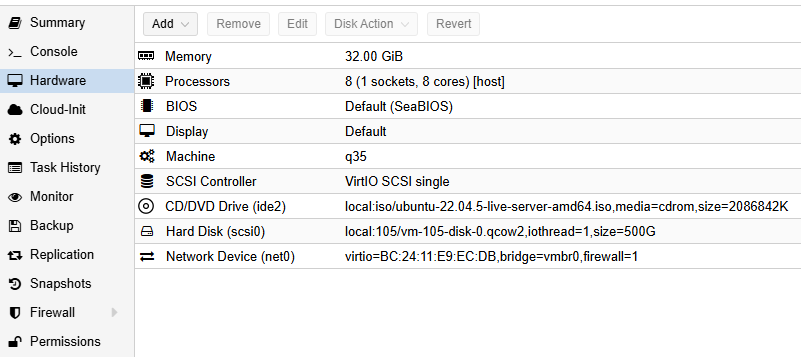
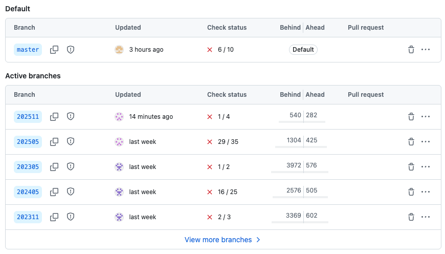

this should cover sonic build on proxmox, baremetal or cloud node (aws ec2, gcp, etc)


## Sonic VS (Virtual Switch) Build

This guide describes how to build the SONiC Virtual Switch (VS) image on an x86_64 (amd64) Ubuntu VM running on a Proxmox hypervisor.

### Host OS

Ubuntu 22.04 LTS is the recommended host OS for building SONiC images and doing development work. Many existing community guides also use the older Ubuntu 20.04 LTS (especially for VS workflows) due to its long track record and broad compatibility. In practice, both are widely used; the key is to follow the dependency and container tooling expectations of the specific SONiC branch you are building. We will focus on Ubuntu 22.04 LTS here.

### Hardware Requirements

| Resource       | Recommended                           |
| -------------- | ------------------------------------- |
| CPU cores      | ≥ 8 cores (more helps, up to a point) |
| RAM size       | ≥ 32 GB (8 GB minimum)                |
| Disk space     | ≥ 300–500 GB (SSD/NVMe preferred)     |
| Virtualization | KVM available (recommended in a VM)   |

- **CPU**: SONiC builds are CPU-intensive (large compiles, packaging, and containerized build steps). More cores reduce build time, especially when using parallel build jobs. Typical recommendation is to have 8 physical cores for reasonable performance. Using more cores helps build speed, but beyond 8 cores there are diminishing returns.

- **RAM**: Builds can consume significant memory, particularly when Docker runs multiple build stages concurrently. Insufficient RAM can slow builds substantially and may trigger OOM failures. 32 GB+ is recommended for a smoother experience.

- **Storage**: SONiC builds generate large intermediate artifacts, container layers, and output packages. Disk consumption increases further when you build multiple targets or increase parallelism. 500 GB free is a comfortable target for repeated builds and cached artifacts. SSD/NVMe significantly improves build throughput due to heavy I/O.

- **KVM**: KVM is not required for every build step, but it is strongly recommended especially when building inside a VM. This is because some workflows may rely on virtualization or run much faster when hardware acceleration is available. Without KVM, tasks can fall back to software emulation, which may be dramatically slower and can lead to timeouts in certain environments.

### Verify Nested Virtualization on Proxmox

On the Proxmox host (via SSH or the web UI shell), check whether nested virtualization is enabled:

For AMD-based systems:

```bash
cat /sys/module/kvm_amd/parameters/nested
```

For Intel-based systems:

```bash
cat /sys/module/kvm_intel/parameters/nested
```

If the output is 1 (or Y on some systems), nested virtualization is enabled. If not, enable it on the Proxmox host and reboot, then ensure the VM CPU type and options are configured to expose virtualization extensions to the guest.

Below is an example of the Proxmox VM hardware configuration used for this build:



### Installing Prerequisites

Wait for the Ubuntu VM to finish booting, then log in and install the required prerequisites.

First make sure to update the package index:

    sudo apt update

Hardware-assisted virtualization is strongly recommended when building SONiC inside a VM. Install the KVM capability checker and verify support:

    sudo apt install -y cpu-checker
    sudo kvm-ok

Expected output for a KVM-capable system:

    /dev/kvm exists
    KVM acceleration can be used

If KVM is not available, the build may still work, but some steps may fall back to software emulation, resulting in significantly slower builds or potential timeouts.

SONiC builds run almost entirely inside Docker containers. Install Docker:

    curl -fsSL https://get.docker.com | sudo bash

Add your username into `docker` group. Log out (or reboot) to apply the change:

    sudo usermod -aG docker $USER

Make sure you can access docker without `sudo`:

    docker ps

Install these packages:

    sudo apt install -y git python3-pip python3-venv

Create a Python virtual environment:

    cd ~
    python3 -m venv my_venv

Activate the environment:

    source ~/my_venv/bin/activate

Install these python packages:

    pip3 install setuptools wheel j2cli jinjanator

Docker typically uses the `overlay2` storage driver, which depends on the `overlay` kernel module. Ensure it is loaded:

    sudo modprobe overlay

SONiC caches downloaded packages and build artifacts in `/var/cache/sonic` to speed up builds, reduce downloads, and make builds reproducible. Make sure the directory exists and is writable:

    sudo mkdir -p /var/cache/sonic
    sudo chown -R $USER:$USER /var/cache/sonic

### Clone and Build SONiC

Clone the official SONiC build image repository with all the git submodules:

    git clone --recurse-submodules https://github.com/sonic-net/sonic-buildimage.git

Go to the root of the repository:

    cd sonic-buildimage

Cloning the `master` branch is typical for VS development. If the latest commit fails to build (which can happen, as `master` is the active development branch), you can check out a stable release tag instead:

    git checkout 202511

SONiC follows a semi-annual release cycle, with major releases typically published in May and November each year.



SONiC historically supported multiple Debian releases (Jessie → Stretch → Buster → Bullseye → Bookworm). The build system can generate base containers for all of them, but this is unnecessary for modern VS builds and significantly increases build time. To restrict the build to Debian Bookworm only:

    export NOJESSIE=1
    export NOSTRETCH=1
    export NOBUSTER=1
    export NOBULLSEYE=1

Retry failed build steps automatically up to 3 times:

    export SONIC_BUILD_RETRY_COUNT=3

This downloads and prepares all required submodules:

    make init

Configure sonic for platform `VS`:

    make configure PLATFORM=vs

Build the SONiC VS image:

    SONIC_BUILD_JOBS=8 make target/sonic-vs.img.gz

This builds the Sonic `.bin` image under `/target`. It then convert it into a QCOW2 image suitable for direct use with QEMU. You do not need to install QEMU on your machine. The build is done inside a container and QEMU is installed inside that environment. You can find `qemu-kvm` listed in [here](https://github.com/sonic-net/sonic-buildimage/blob/master/sonic-slave-bookworm/Dockerfile.j2).

### Running Sonic VS

To run Sonic VS inside QEMU, refer to [this guide](https://github.com/ManiAm/sonic-proxy/blob/master/README_Sonic.md#option-3-run-sonic-with-qcow2-image).

To run Sonic VS inside GNS3, refer to [this guide](https://github.com/ManiAm/GNS-Bench/blob/master/docs/04_GNS3_Sonic_VS.md#creating-a-sonic-gns3-appliance).

### Supported Vendors

In this guide, SONiC is built as a VS. However, SONiC also supports a wide range of physical switch platforms from different vendors. A list of platforms available in the upstream repository can be found [here](https://github.com/sonic-net/sonic-buildimage/tree/master/platform).

The upstream sonic-buildimage repository only shows the platforms that have been contributed and accepted into the community tree. Some vendors such as Cisco publicly market "SONiC on Cisco 8000" and have [official docs](https://www.cisco.com/site/us/en/products/networking/sdwan-routers/8000-series/sonic/index.html) for it. However, the full platform support lives in a separate [internal repository](https://github.com/sonic-net/sonic-buildimage/blob/master/platform/checkout/cisco-8000.ini). This is pretty standard in the SONiC ecosystem. Typical reasons:

- **Proprietary SDK**: Silicon One SDK, low-level drivers, some diag/manufacturing tools are covered by NDAs or have licensing terms that don’t allow just dumping everything into a public GitHub repo.

- **Productization and Support Model**: Cisco sells "SONiC on Cisco 8000" as a supported product, not "DIY from upstream source". They want a controlled build pipeline, validation, regression testing, and a known-good image they can support. Letting everyone build arbitrary images and call TAC would be a support nightmare.

- **Commercial Differentiation**: Even though SONiC is open NOS, vendors want room for extra features, monitoring/telemetry, integration glue, provisioning hooks, etc. that they don’t necessarily want to drop into the neutral, multi-vendor upstream tree.
